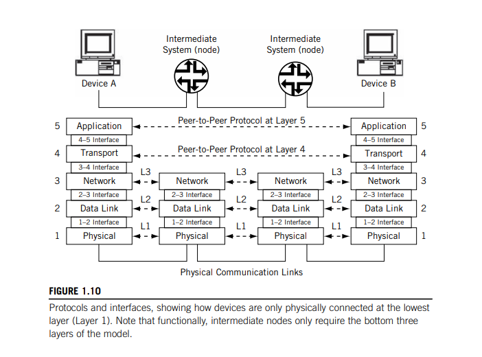
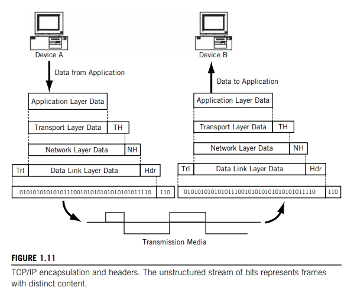
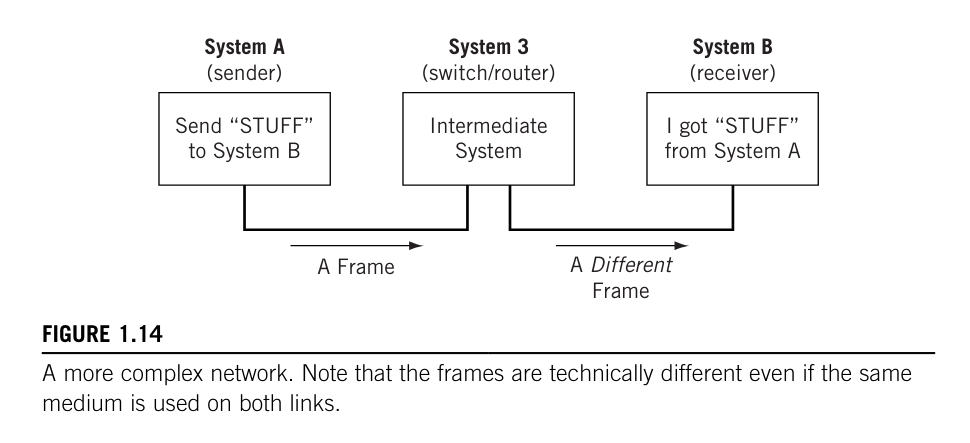
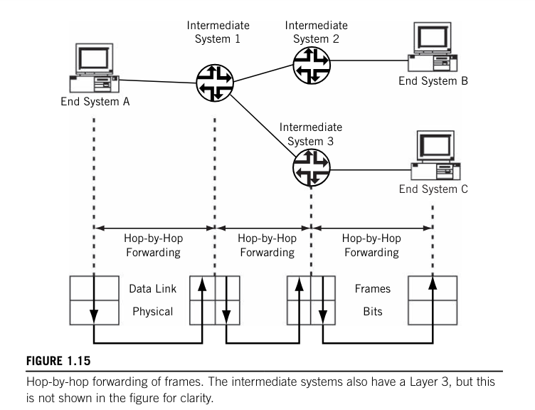
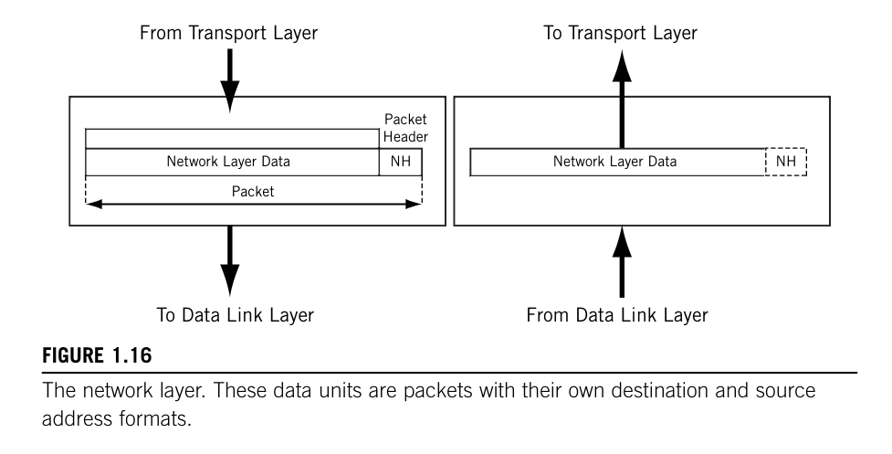
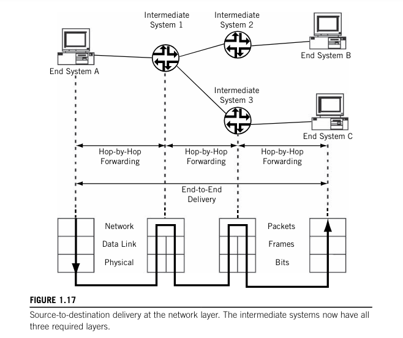

# Protocols and Layers

## Layers

Data communication networks rely on *layered* protocols.

<u>Processes running on a system</u> and the communication ports that send and receive network bits <u>are logically connected by a series of layers</u>, <u>each performing one major function of the networking task.</u>

Each layer in the protocol stack has a distinct purpose and function. Each protocol layer handles part of the overall task.

### Protocol Layers

Each layer has a separate function in the overall task of moving bits between processes.

As long as the boundary functions between adjacent layers are respected, **(due to the decoupled nature)** 👉 layers can be changed or even completely rewritten without having to change the whole application. <u></u>Layers can be combined for efficiency, "mixed-and-matched" from different vendors, or customized for different circumstances, all without having to rework the entire stack from top to bottom.

## The TCP/IP Protocol Suite

The protocol stack used on the Internet is the Internet Protocol Suite. <u>It is usually called TCP/IP after two of its most prominent protocols, but there are other protocols as well</u>.

The TCP/IP model <u>is based on a five-layer model for networking</u>. From bottom (the link) to top (the user application), these are

- the physical,
- data link,
- network,
- transport, and
- application layers.

Not all layers are completely defined by the model, so these layers are “filled in” by external standards and protocols.

Two compatible end-system applications can communicate regardless of their underlying architectures, although the connections between layers are not defined.

The TCP/IP layers contain relatively independent protocols that can be used <u>depending on the needs of the system to provide whatever function is desired</u>. For example, there are different application layer protocols each providing the system with specific functionality and/or behaviour.

### The TCP/IP Layers

The Internet protocol suite assumes that a layer is there and available, so TCP/IP does not define the layers themselves. *The stack consist of protocols, not implementations, so describing a layer or protocols says almost nothing about how these things should actually be built*.

<u>Not all systems on a network need to implement all five layers of TCP/IP.</u> **Devices using the TCP/IP protocol stack fall into two general categories**: *a host* or *end system* (ES) and an *intermediate node* (often a router) or an *intermediate system* (IS).
<u>The intermediate nodes usually only involve the first three layers of TCP/IP.</u>

Each implemented layer has an *interface* with the layers above and below it (except for the application and physical layers, of course) and provides its defined service to the layer above and obtains services from the layer below. In other words, <u>there is a *service interface* between each layer,</u> *but these are not standardized and vary widely by operating
system.*

Individual layers can be combined for implementation purposes, *as long as the service interfaces to the layers remain intact*. <u>Layers can even be split when necessary, and new service interfaces defined.</u> Services are provided to the layer above after the higher layer provides the lower layer with the command, data, and necessary parameters for the lower layer to carry out the task.

Layers on the same system provide and obtain services to and from adjacent layers. However, <u>a *peer-to-peer protocol process* allows the same layers on different systems to communicate</u>. The term peer means every implementation of some layer is essentially equal to all others. Communications between peer layers on different systems use the defined protocols appropriate to the given layer.

In other words, ***services*** refer to <u>communications between layers within the same process,</u> and ***protocols*** refer to <u>communications between processes.</u>

### Protocols and Interfaces

It is important to note that <u>when the layers of TCP/IP are on different systems, they are only connected at the physical layer.</u> *Direct peer-to-peer communication between all other layers is impossible.* This means that <u>all data from an application have to flow “down” through all five layers at the sender, and “up” all five layers at the receiver to reach the correct process on the other system.</u> These data are sometimes called a *service data unit* (SDU).

Each layer on the sending system adds information to the data it receives from the layer above and passes it all to the layer below (except for the physical layer, which has no lower layers to rely on in the model and actually has to send the bits in a form appropriate for the communications link used).

Likewise, each layer on the receiving system unwraps the received message, often called a *protocol data unit* (PDU), with each layer examining, using, and stripping off the information it needs to complete its task, and passing the remainder up to the next layer (except for the application layer, which passes what’s left off to the application program itself).

As shown in the figure,

- there is a natural grouping of the five-layer protocol stack at the network layer and the transport layer.
- <u>The lower three layers of TCP/
IP, sometimes called the *network support layers*, must be present and functional on all systems, regardless of the end system or intermediate node role.</u>
- The transport layer links the upper and lower layers together. This layer can be used to make sure that what was sent was received, and what was sent is useful to the receiver.

The process of encapsulation makes the whole architecture workable. <u>**Encapsulation of one layer’s information inside another layer is a key part of how TCP/IP works.**</u>

### Encapsulation

Each layer uses encapsulation to add the information its peer needs on the receiving system.

- The network layer adds a header to the information it receives from the transport at the sender and passes the whole unit down to the data link layer.
- At the receiver, the network layer looks at the control information, usually in a *header*, in the data it receives from the data link layer and passes the remainder up to the transport layer for further processing.
- This is called encapsulation because one layer has no idea what the structure or meaning of the PDU is at other layers. *The PDU has several more or less official names for the structure at each layer.*

The exception to this general rule is the data link layer, which adds both a *header* and a *trailer* to the data it receives from the network layer. The general flow of encapsulation in TCP/IP is shown above.

- Note that on the transmission media itself (or communications link), there are only bits, and that some
“extra” bits are added by the communication link for its own purposes.
- Each PDU at the other layers is labeled as data for its layer, and the headers are abbreviated by layer name.
- The exception is the second layer, the data link layer, which shows a header and trailer added at that level of encapsulation.

## The layers of TCP/IP

### The Physical Layer

The actual physical connection between two network devices.

The physical layer contains all the functions needed to carry the bit stream over a physical medium to another system. The transmission medium forms a pure “bit pipe” and should not change the bits sent in any way.

Now, <u>transmission “on the wire” might send bits through an extremely complex transform, but the goal is to enable the receiver to reconstruct the bit stream exactly as sent</u>. *Some information in the form of transmission framing can be added to the data link layer data, but this is only used by the physical layer and the transmission medium itself.*

**Physical layer specifications have four parts**: mechanical, electrical or optical, functional, and procedural.

- The **mechanical part** <u>specifies the physical size and shape of the connector itself</u> so that components will plug into each other easily.
- The **electrical/optical specification** <u>determines what value of voltage or line condition determines whether a pin is active or what exactly represents a 0 or 1 bit</u>.
- The **functional specification** <u>specifies the function of each pin or lead on the connector</u> (first lead is send, second is receive, and so on).
- The **procedural specification** <u>details the sequence of actions that must take place to send or receive bits on the interface</u>. (For Ethernet, the send pair is activated, then a “preamble” is sent, and so forth.)

There are **other things that the physical layer must determine:**

- Data rate
- Bit synchronization
- **Configuration:** So far we’ve assumed simple **point-to-point** links, but this is not the only <u>way that systems are connected</u>. In a **multipoint** configuration, a link connects more than two devices, and in a multisystem bus/broadcast topology such as a LAN, the number of systems can be very high.
- **Topology:** <u>The devices can be *arranged* in a number of ways</u>. In a **full mesh** topology, all devices are directly connected and one hop away, but this requires a staggering amount of links for even a modest network. Systems can also be arranged as a **star** topology, with all systems reachable through a central system. There is also the **bus** (all devices are on a common link) and the **ring** (devices are chained together, and the last is linked to the first, forming a ring).
- **Mode:** So far, we’ve only talked about one of the systems as the sender and the other as the receiver. This is operation in **simplex** mode, <u>where a device can only send or receive</u>, such as with weather sensors reporting to a remote weather station. More realistic devices use **duplex** mode, <u>where all systems can send or receive</u> with equal facility. This is often further distinguished as **half-duplex** (<u>the system can send and receive, but not at the same time</u>) and **full-duplex** (<u>simultaneous sending and receiving</u>)

### The Data Link Layer

Bits are just bits. The role of the physical layer is just to carry the bits given to it over to next computer. With only the physical layer, System A has no way to tell System B, “Get ready some bits,” “Here are the bits,” and “Did you get those bits okay?”

The data link layer solves this problem by <u>organizing the bit stream into a data unit called a **frame**.</u>

> It is important to note that frames are the data link layer PDUs, and these are not the same as the physical layer transmission frames.  Transmission frames have control information used to manage the physical link itself and has little to do directly with process-to-process communications.

The data link layer usually adds both a header and trailer to the data presented by the network layer.

The **frame header** typically <u>contains a source and destination address (known as the “physical address” since it refers to the physical communication port)</u> and some control information. *The control information is data passed from one data link layer to the other data link layer, and not user data.*

The **body of the fram**e contains the sequence of bits being transferred across the network.

The **trailer** usually contains information used in detecting bit errors (such as cyclical redundancy check [CRC]).

<u>A maximum size is associated with the frame</u> that cannot be exceeded because all systems must allocate memory space (buffers) for the data.

The data link layer performs **framing**, **physical addressing**, and **error detection**.

> When it comes to frame error detection and correction in the real world, error detection bits are sometimes ignored and frames that defy processing due to errors are simply discarded. In discard cases, the chore of handling the error condition is “pushed up the stack” to a higher layer protocol.

This layer also performs **access control** (this determines whose turn it is to send over or control the link, an issue that becomes more and more interesting as the number of devices sharing the link grows).

<u>In LANs, this media access control (MAC) forms a sublayer of the data link layer</u> and has its own addressing scheme known (not surprisingly) as the MAC layer address or MAC address.

It is enough to note that LANs such as Ethernet do not have “real” physical layer addresses and that the MAC address performs this addressing function.

In addition, the data link layer can perform some type of **flow control**.

Flow control makes sure senders do not overwhelm receivers: a receiver must have adequate time to process the data arriving in its buffers.

<u>At this layer, the flow control</u>, if provided, <u>is link-by-link</u>. (We’ll see shortly that end-to-end or host-to-host flow control is provided by the transport layer.)

Not all destination systems are directly reachable by the sender. This means that <u>when bits at the data link layer are sent from an originating system, the bits do not arrive at the destination system as the “next hop” along the way.</u>. **Directly reachable systems are called adjacent systems, and adjacent systems are always “one hop away” from the sender**.

When the destination system is not directly reachable by the sender, one or more intermediate nodes are needed.

Consider the network shown below:

Now the sender (System A) is not directly connected to the receiver (System B). <u>Another system, System 3, receives the frame and must forward it toward the destination. This system is usually called a **switch** or **router**.</u>

On a WAN (but not on a LAN), this second frame is a different frame because there is no guarantee that the second link is identical to the first. **Different links need different frames**. <u>Identical frames are only delivered to systems that are directly reachable</u>, or adjacent, to the sender, such as by an Ethernet switch on a LAN.

**Networking with intermediate systems is called hop-by-hop delivery.** A “hop” is the usual term used on the Internet or a router network to indicate the forwarding of a packet between one router or another (or between a host and router). *From one system to an immediate (directly connected) system, layman speaking.*

Frames can “hop” between Layer 2 switches, but the term is most commonly used for Layer 3 router hops (which can consist of multiple switch-to-switch frame “hops”).

Consider, in the figure below, the case where End System A is sending a bit stream to End System C.

Note that the intermediate systems (routers) have two distinct physical and data link layers, reflecting the fact that the systems have two (and often more) communication links, which can differ in many ways.

The figure shows a typical WAN configuration with point-to-point links, but routers on LANs. However, *there is no connection between the data link layers on the intermediate systems!* **How does the router know to which output port and link to forward the data in order to ultimately reach the destination?** <u>These forwarding decisions are made at the TCP/IP ***network layer***.</u>

### The Network Layer

The network layer delivers data in the form of a packet from source to destination, across as many links as necessary.

The biggest difference between the network layer and the data link layer is that *the data link layer is in charge of data delivery between adjacent systems* (directly connected systems one hop away), while *the network layer delivers data to systems that are not directly connected to the source.*

There can be many *different types of data link and physical layers* on the network, depending on the variety of the link types, but *the network layer is essentially the same on all systems*, end systems, and intermediate systems alike.

The figure below shows the relationship between the network layer and the transport layer above and the data link layer below.

A packet header is put in place at the sender and interpreted by the receiver. **A router simply looks at the packet header and makes a forwarding decision based on this information.**

<u>How does the network layer know where the packet came from (so the sender can reply)?</u> The key concept at the network layer is **the network address**, which provides this information. In TCP/IP, the network address is **the IP address**.

Every system in the network receives a network address, whether an end system or intermediate system. Systems require at least one network address (and sometimes many more).

It is important to realize that this network address is different from, and independent of, the (link layer) physical address used by the frames that carry the packets between adjacent systems.

A key issue is <u>how the network addresses “map” to physical addresses</u>, a process known generally as address resolution. In TCP/IP, a special family of **address resolution protocols takes care of this process**.

IP network addresses are globally administered, unique, and have a portion under which many devices are grouped. Therefore, many devices can be addressed concisely by this network portion of the IP address.

The sender need only look at the “network” portion of the address to determine if the destination is local (network portions are the same) or needs to be sent to an intermediate system to reach the destination (source and destination nework portions differ).

In TCP/IP, the network address is the beginning of the device’s complete IP address.

<u>In some cases, the packet that arrives at an intermediate system inside a frame is too large to fit inside the frame that must be sent out</u>. This is not uncommon: different link and LAN types have different maximum frame sizes. **The network layer must be able to fragment a data unit across multiple frames and reassemble the fragments at the destination**. A process known as **fragmentation**.

The network layer uses one or more **routing tables** <u>to store information about reachable systems.</u> The whole <u>process of building tables to pass data from source to destination</u> is called **routing**, and <u>the use of these tables for packet delivery</u> is called **forwarding**.

The forwarding of packets inside frames always takes place hop by hop. This is shown in the figure below, which adds the network layer to the data link layers already present and distinguishes between hop-by-hop forwarding and end-to-end delivery.

On the Internet, the inetermediate systems that act at the packet level (Layer 3) are called **routers**. Devices that act on frames (Layer 2) are called **switches**.

### The Transport Layer

**Process-to-process delivery** is the task of the transport layer. *Getting a packet to the destination system is not quite the same thing as determining which process should receive the packet’s content.*

Naturally, the destination process has to know on which process the sender originated the bits inside the packet in order to reply.

Systems cannot simply transfer a huge multimegabit file all in one packet. Many data units exceed the maximum allowable size of a packet, and must be divided into seperate packets. This process of <u>dividing message content into packets</u> is known as **segmentation**.

The network layer forwards each and every packet independently, and does not recognize any relationship between the packets. (Is this a file transfer or email packet? The network layer does not care.) <u>The transport layer,</u> in contrast, <u>can make sure the whole message, often strung out in a sequence of packets, arrives in order</u> (packets can be delivered out of sequence) <u>and intact</u> (there are no errors in the entire message). This function of the transport layer involves some method of **flow control and error control** (error detection and error correction) at the transport layer, functions which are absent at the network layer. <u>The transport-layer protocol that performs all of these functions is the **Transmission Control Protocol (TCP)**</u>.

The transport-layer protocol does not have to do any of this, of course. In many cases, the content of the packet forms a complete unit (a whole message) all by itself, called **a datagram.** Self-contained <u>datagrams are not concerned with sequencing or flow control, and these functions are absent in the User Datagram Protocol (UDP) at the transport layer.</u>

**TCP** is a connection-oriented, “reliable” service that provides ordered delivery of packet contents. While, **UDP** is a connectionless, “unreliable” service that does not provide ordered delivery of packet contents.

The network layer gets a single packet to the right system, and the transport layer gets (all the packets that make up) the entire message to the right process.

The figure below shows the transport layer breaking up a message at the sender into three pieces (each labeled “TL data” for transport-layer data and “TH” for transport-layer header). The figure then shows the transport layer reassembling the message at the receiver from the various segments that make up a message.

> In TCP/IP, there are also data units known as <u>**datagrams**, which are always handled as self-contained units.</u> There are profound differences between how the transport layer treats segments and datagrams, but this figure is just a general illustration of segment handling.

