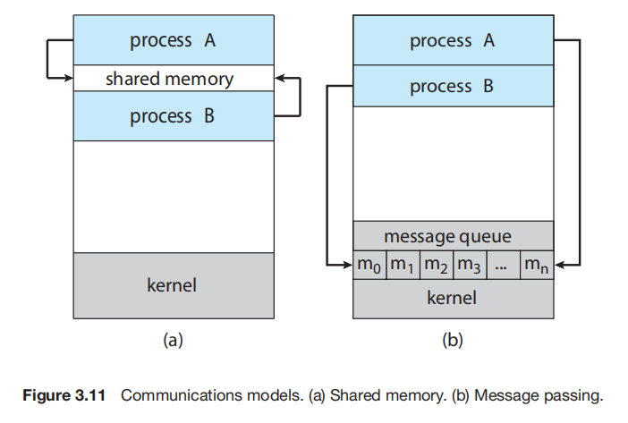

# Intro
IPC is **the mechanism that allows processes to exchange data**.

There are two fundamental models of IPC: 
- **shared memory**: <u>a region of memory that is shared</u> by the communicating processes is established.
- and **message passing**: communicating processes <u>exchange messsages</u> between them.



# IPC in shared memory systems
Using this technique, requires communicating processes to establish a region of shared memory. A shared memory segment is created by one of the communicating processes in its address space. Other processes that wishes to communicate must attach it to their address space.
- Communicating processes must agree to remove the restriction that the operating system places on one process accessing the memory of another process.
- They can then exchange information by reading and writing data in the shared areas. The processes are also responsible for ensueing that they are not writing to the same location simultaneously.

An example of this technique, is the producer-consumer problem, where the producer process writes (produces data) to the shared memory, and the cosumer process read (consumes data) from the shared memory.

To allow the producer and consumer processes to run concurrently, a buffer resides in this region of shared memory. The producer fills the buffer with data items, and the consumer empties the buffer of data items.

The producer and consumer must be synchronized, so that 
- the producer must wait when the buffer is full (bounded buffer),
- the consumer must wait when the buffer is empty, 
- and most especially <u>the processes must not access the shared memory while one is still at work, one must wait for the other to finish performing its *producing* or *consuming* operation</u>.
  - Normally, only one process can be "running" at one time, let's say this time it's the producer process, but if the operating system context-switches to the consumer process while the producer process has not yet finished producing, the consumer process will be trying to access no data. We don't want this. Hence, the need for a synchronization mechanism between these processes.

Two types of buffer can be used:
- Bounded buffer: This type of buffer has a size limit, the producer must wait if the buffer is full, and the consumer must wait if the buffer is empty.
- Unbouded buffer: This type of buffer has no size limit, the producer can keep putting data items into the buffer, but the consumer must still wait if the buffer is empty.

The buffer management, process synchronization and all other operations involved in shared memory communication, is handled by the application programmer.

# IPC in message passing systems
In this technique, the operating system provides the means for cooperating processes to communicate via message-passing.

**Message passing provides a mechanism to allow processes to communicate and to synchronize their actions without sharing the same address space**. It is particularly useful in a distributed environment, where the communicating proceses may reside on different computers connected by a network.

If two processes `P` and `Q` must *send messages to and receive messages from* each other, <u>a **communication link** must exist</u> between them.

> Methods for implementing the communication link:

These are more like decisions on how we should implement the communication link.
- Direct or Indirect communication
- Synchronous or asynchronous communication
- Automatic or explicit buffering


## Naming: Direct or Indirect
### Direct Communication
Each process that wants to communicate must explicitly **name the recipient or sender of the communication**.

Direct communication can take two approaches,
- Symmetrical addressing: in which the sender and the receiver refer to each other by name.
  - `send(P, message)`
  - `receive(Q, message)`
- Asymmetrical addressing: in which only the sender refer to the receiver by name. While the receiver wants to receive from any process.
  - `send(P, message)`
  - `receive(id, message)` - where `id` is set to that of the sender process it receives from.

There's also a temporary queue as a communication link, but it's dedicated only to the two processes.

This direct communication is **less desirable**.

### Indirect Communication
**The messages are sent to and received from mailboxes, or ports**. <u>A sender process places the message in this mailbox, while a receiver process removes the message from the mailbox</u>.  

Each mailbox has a unique identification. Two processes can communicate via a number of different mailboxes, only if they share that mailbox.

- `send(A, message)` - Send `message` to mailbox `A`
- `receive(A, message)` - Receive `message` from mailbox `A`

As opposed to Direct communication. This is more desirable.


## Syncronization: Synchronous or Asynchronous
Depending on the implementation of the `send()` and `receive()` primitives, message passing can be either **blocking** or **non-blocking**.
- Blocking send: The sending process is blocked until the messag is received by the receiving process or by the mailbox.
- Non-blocking send: The sending proces sends the message and resumes operation.
- Blocking receive: The receiver blocks until a message is available.
- Non-blocking receive: The receiver retrieves either a valid message or a null.

## Buffering
The temporary message queue used by the communicating processes can be implemented in three ways:
- **Zero capacity:** Queue has a maximum length of zero; the link cannot have messages waiting in it. The sender must block until the recipient receives the message. This is also known as *a message system with no buffering*.
- **Bounded capacity:** The queue can only take $n$ items at most. The sender can keep sending messages if the queue isn't full, else, it waits and blocks, until there's available space in the queue.
- **Unbounded capacity:** The queue can take an infinite number of items. The sender keeps sending without waiting/blocking. The receiver keeps receiving unless the queue is empty in which case it waits and blocks, until message is available in the queue.

## Pipes
A pipe acts as a conduit allowing two processes to communicate.

**In implementing a pipe, four issues must be considered**:
1. Does the pipe allow <u>bidirectional</u> communication, or is the communication <u>unidirectional</u>?
2. If bidirectional communication is allowed, is it <u>half duplex</u> (data can travel only one direction at a time) or <u>full duplex</u> (data can travel in both directions simultaneously)?
3. Must a relationship (such as *parent-child*) exist between the communicating processes?
4. Can the pipes communicate over a network, or must the communicating processes reside on the same machine?


## Ordinary Pipes
Ordinary pipes allow two processes to communicate in standard producer-consumer fashion: the producer writes to one end of the pipe (write end) and the consumer reads from the other end (read end). 

Ordinary pipes are unidirectional. If bidirectional communication is required, two pipes must be used, with each pipe sending data in a different direction.

Ordinary pipes are constructed using the function
```c
pipe(int fd[])
```
This function creates a pipe that is accessed through the `int fd[]` file descriptors: `fd[0]` is the read end of the pipe, and `fd[1]` is the write end. Pipes can be accessed using ordinary `read()` and `write()` system calls, as they are treated as a special type of file.

An ordinary pipe cannot be accessed from outside the process that created it. Typically, a parent process creates a pipe and uses it to communicate with a child process that it creates via `fork()`.
- Recall that a child process inherits open files from its parent. Since a pipe is a special type of file, the child inherits the pipe from its parent process.

```c
#include <sys/types.h>
#include <stdio.h>
#include <string.h>
#include <unistd.h>

#define BUFFER_SIZE 25
#define READ_END 0
#define WRITE_END 1

int main() {
  char write_msg[BUFFER_SIZE] = "Hey! How're you?";
  char read_msg[BUFFER_SIZE];

  int fd[2];

  pid_t pid;

  /* create the pipe */
  // The argument to pipe() is an empty array of two integers. A file descriptor is stored in each space. The first fd[0] is the file we read from (becomes read end of the pipe), while the second fd[1] is the file we write to (becomes write end of the pipe).
  if (pipe(fd) == -1) { // handle error creating pipe
    fprintf(stderr, "Pipe creation failed");
    return 1;
  }

  /* fork a child process */
  // forking a child process inherits the file decriptors created by the parent process above so it has access to it.
  pid = fork();

  if (pid < 0) { // handle error creating child process
    fprintf(stderr, "Fork failed");
    return 1;
  }

  /* In the parent process: write to the pipe */
  if (pid > 0) {
    /* close the unused end of the pipe, so the child process won't read it while its still empty */
    close(fd[READ_END]);

    /* write to the pipe */
    write(fd[WRITE_END], write_msg, strlen(write_msg) + 1);
    printf("written: %s\n", write_msg);

    /* close the write end, we're done writing */
    close(fd[WRITE_END]);
  } else {
    /* to avoid interruption */
    close(fd[WRITE_END]);

    /* read from the pipe */
    read(fd[READ_END], read_msg, BUFFER_SIZE);
    printf("read: %s\n", read_msg);

    /* close the read end, we're done reading */
    close(fd[READ_END]);
  }

  return 0;
}
```

<u>Ordinary pipes require a parent-child relationship between the communicating processes</u>. This means that *ordinary pipes can be used only for communication between processes on the same machine*.

## Named pipes
Named pipes provide a much more powerful communication tool. Communication can be bidirectional, and no parent-child relationship is required.
- Once a named pipe is establised, several processes can use it for communication. 
- A named pipe, typically, has several writers. 
- Named pipes continue to exist after communicating processes have finised.

Named pipes are reffered to as FIFOs in UNIX systems. Once created, they appear as typical files in the file system. 

- Use `mkfifo()` system call to create a named pipe. Use file access system calls to manipulate it just like a file. It will continue to exist until it is explicitly deleted from the file system.

- Although FIFOs allow bidirectional communication, only half-duplex transmission is permitted. If full-duplex transmission is requred two FIFOs are typically used.
  - Additionally, the communicating processes must reside on the same machine. If intermachine communication is required, **sockets** must be used.
  - Only byte-oriented data may be transmitted across a UNIX FIFO.

Named pipes on Windows systems provide a richer communication mechanism than their UNIX counterparts.
  - Full-duplex is allowed
  - Communicating processes can be on the same or different machines.
  - Allows either byte-oriented or message-oriented data.
  - `CreateNamedPipe()`, `ConnectNamedPipe()` for creation and connection respectively.
  - `ReadFile()` and `WriteFile()` for access.

---

**Communication using sockets**, although common and efficient, <u>is considered a low-level form of communication between distributed processes</u>. 
- One **reason** is that <u>sockets allow only an unstructured stream of bytes to be exchanged between the communicating threads</u>. 
- It is the responsibility of the client or server application to impose a structure of the data. Hence, the need for application-level protocols, that requires two communicating processes to define and agree on the structure with which they communicate. HTTP, SMTP, WebSocket etc.

---
---

# IPC (Wikipedia)
