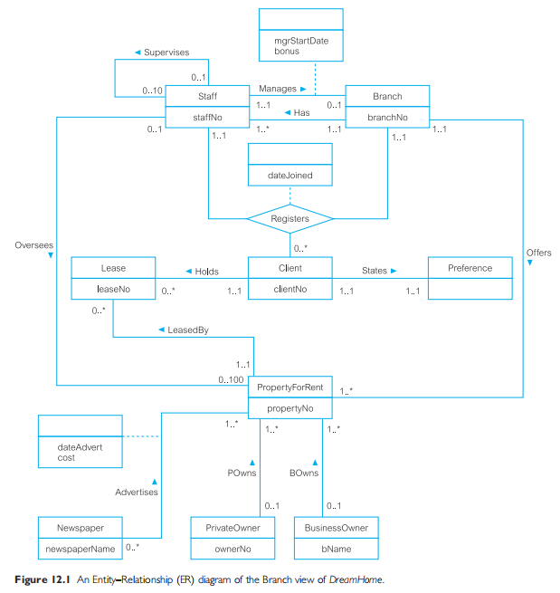

# Intro
ER modeling is a top-down approach to database design that <u>begins by identifying</u> the important data called ***entities*** and ***relationships*** between the data **that must be represented in the model**</u>. We than add more details, such as the information we want to hold about the entities and relationships called ***attributes*** and any ***constraints*** on the entities, relationshipts, and attributes.

**<u>ER modeling is an important technique for any database designer to master.</u>**

UML is currently recognized as the de facto industry standard modeling language for object-oriented softwae engineering projects.

# Entity Types
> **Entity type:**\
A group of "objects" in the "real world" with the same properties, which are identified as having an independent existence.\
<u>Can be objects with a physical (real) existence or objects with a conceptual (abstract) existence</u>.

> **Entity occurence:**\
A uniquely identifiable object of an entity type.

Primary key attributes uniquely identify each entity occurence.

> Diagramtic representation of entity types

Each entity type is shown as **a rectangle**, labeled wth the name of the entity, which is normally a singular noun writen in `CamelCase`.

# Relationship Types
> **Relationship type:**\
A set of meaningful associations among one or more participating entity types.\
Each relationship type is given <u>a name that describes its function</u>.

> **Relationship occurence:**\
A uniquely identifiable association that includes one occurence from each participating entity type.

Consider a relationship type called <u>`Has`</u>, which represents an association between `Branch` and `Staff` entities, tha is `Branch` <u>*`Has`*</u> `Staff`. Each occurence of the <u>*`Has`*</u> relationship associates one `Branch` entity occurence with one `Staff` entity occurence.

> Diagrammatic representation of relationship types

Each relationship type is shown as <u>**a line connecting** the associated entity types and **labeled with** the **name of the relationship**</u>.
- A relationship is <u>only labeled in one direction</u>, which normally *means that the name of the relationship only makes sense in one direction*.

Usually, a relationship is <u>***named*** using **a verb** (e.g. *`Supervises`* or *`Manages`*) or **a short phrase including a  verb**, *`LeasedBy`*</u>. 

Whenever possible, a **relationship name** should be <u>unique for a given ER model</u>.

## Degree of Relationship Type
> **Degree of a relationship type**\
The number of participating entity types in a relationship.

A relationship of degree two is called binary, degree three is called ternary, degree four is called quaternary.

The term **"complex relationship**" is used to describe <u>relationships with degrees higher than binary</u>.

> Diagrammatic representation of complex relationships

The UML notation uses **a diamond** to represent relationships with degrees higher than binary. The name of the relationship is rather displayed inside the diamond.

## Recursive Relationship
> **Recursive relationship**\
A relationship type in which **the same entity type participates more than once <u>in different roles</u>**.

Consider a recursive relationship called <u>*`Supervises`*</u>, which represents <u>an association of staff with a Supervisor where the Supervisor is also a member of staff</u>. The `Staff` entity type participates twice in the <u>*`Supervises`*</u> relationship,  first as a **Supervisor**, and the second as a member of staff who is supervised (**Supervisee**).

They are sometimes called ***unary* relationships**.

Relationships may be given **role names** <u>to indicate the purpose that each participating entity type plays in a relationship</u>.
- They are <u>important for recursive relationships</u>.
- Role names may also be used <u>when two entities are associated through more than one relationship</u>. For example, `Staff` (Role: Manager) <u>*`Manages`*</u> `Branch` and `Branch` <u>*`Has`*</u> `Staff` (Role: Member of staff). *It clarifies the purpose of each relationship*.
- Role names are usually not required if the function of the participating entities in a relationsip is unambiguos.

# Attributes
> **Attribute**\
A property(ies) of an entity or a relationship type.

For `Staff` entity type. `staffNo`, `name`, `position`, and `salary` could be attributes.

The attributes <u>hold values that describe each entity occurence</u> and <u>represent the main part of the data stored in the database</u>.

> **Attribute domain**\
The set of allowable values for one or more attributes.

The **domain** defines <u>the potential values that an attribute may hold</u> and is similar to the domain concept in the relational model

## Simple and Composite Attributes
> **Simple attribute**\
An attribute <u>composed of a single component</u> with an independent existence. e.g. `position` and `salary`.

> **Simple attribute**\
An attribute <u>composed of multiple components</u>, each with an independent existence. e.g. `address` can be subdivided into `street`, `city` and `postcode` attributes.

## Single-valued and Multi-valued Attributes
> **Single-valued attribute**\
An attribute that <u>holds a single value for each occurence</u> of an entity type.

This is the most common. A user's ID for example.

> **Multi-valued attribute**\
An attribute that <u>holds multiple values for each occurence</u> of an entity type.

For example, we may want a user to submit multiple phone numbers.

## Derived Attributes
> **Derived attribute**\
An attribute that represents <u>a value that is derivable from the value of a related attribtue or set of attributes</u>, not necessarily in the same entity type.

## Keys
> **Candidate key**\
The minimal set of attributes that uniquely identifies each occurence of an entity type.

The candidate key **must hold values that are unique for every occurence** of an entity type. This implies that <u>a candidate key cannot contain a null</u>.

> **Primary key**\
The <u>candidate key that is **selected**</u> to uniquely identify each occurence of an entity type.

A relation can have more than one candidate keys, thus, **other candidate keys apart from the one selected** are referred to as <u>alternate keys</u>.

> **Composite key**\
A candidate key that consists of two or more attributes.

The **values of the attributes together** are <u>***unique***</u> for each entity occurence but <del>not separately</del>.

> Diagrammatic representation of attributes

An entity type's rectangle is divided into two. The **upper part** of the rectangle <u>displays the name of the entity</u>, and the **lower part** <u>lists the names of the attributes</u>.

The first attribute(s) to be listed is the primary key for the entity type, if known. The name(s) of primary key attribute(s) can be labeled with the tag `{PK}` (if other attributes follow, if not (only primary key is listed), it can be ommited).

The name of an attribute is written in `camelCase` (first-letter in lowercase).

For multi-valued attributes, we label the attribute name with an indication of the range of values available for the attribute. For example, `attr[1...*]` indicates one or more values for the attribute `attr`. If the exact maximum value is known, you can use `attr[1...3]`, where `3` is the max value.

For composite attributes, indent the child attibute list under the parent attribute.

# Strong and Weak Entity Types
> **Strong entity type**\
An entity type that does not depend on the existence of another entity type.

A characteristic of a strong entity type is that <u>each entity occurence is uniquely identifiable using the primary key attribute(s)</u> of that entity type.

> **Weak entity type**\
An entity type that is dependent on the existence of another entity type.

A characteristic of a weak entity is that each entity occurence <u>cannot be uniquely identified using **only** the attributes associated with that entity type</u>.

We can uniquely identity each entity occurence only through the relationship it has with <u>another entity occurence who is uniquely identifiable with a primary key - **owner entity**</u>.

# Attributes on Relationsips
These are new attributes that we derive from the relationship between two entity types.

Consider the relationship <u>*`Advertises`*</u>, which associates the `Newspaper` and `PropertyForRent` entity types. Two attributes are derived, `dateAdvert` (date of advertisment) and `cost` (cost of advertisment).

**The presence of one or more attributes assigned to a relationship** <u>***may indicate*** that the relationship conceals an unidentified entity type</u>. Be on look out, as this can help in Normalization.
- For example, the attributes that we derive from the <u>*`Advertises`*</u> relationship above, indicates the presence of an entity called `Advert`.

# Structural Constraints
The constraints that may be placed on entity types that participate in a relationship.

The constraints should reflect the restrictions on the relationships, as perceived in the "real world". For example, the requirements that a property for rent must have an owner and each branch must have a staff.

The main type of constraint on relationships is called **multiplicity**.

> **Multiplicity**\
The number (or range) of possible occurences on an entity type that may relate to a single occurence of an associated entity type through a particular relationship.

Multiplicity constrains the way entities are related. <u>It is a representation of the business rules established by the user or the enterprise</u>.

Esuring that all appropriate constraints are identified and represented is <u>an important part of modeling an enterprise</u>.

**Binary relationships** are generally referred to as being 
- one-to-one (`1:1`) : One university has one public library
- one-to-many (`1:*`) : One user has many posts
- or many-to-many (`*:*`) : Many actors features in many movies

## Cardinality and Participation Constraints
Multiplicity actually consists of two separate constraints known as cardinality and participation.

> **Cardinality**\
This describes the <u>**maximum number of possible relationship occurences** for an entity participating in a given relationship type</u>.

The **cardinality** of a binary relationship is what we actually refer to when we say, <u>one-to-one (`1:1`), one-to-many (`1:*`), and many-to-many (`*:*`)</u>.

It appears as <u>***the maximum values*** for the multiplicity ranges of either side of the relationship</u>.

> **Participation**\
This determines <u>whether **all or only some entity occurences** participate in a relationship</u>.

When **all occurencies** participate, we say it's a <u>**mandatory** participation</u>. When **only some occurencies** participate, we say it's an <u>**optional** participation</u>.

The participation of entities in a relationship appears as <u>**the minimum values** for the multiplicity ranges on either side of the relationship</u>.

> **Multiplicity range ($p..c$)**\
The multiplicity range of an entity type partaking in a relationsip, represents <u>the minimum (participation $p$) to maximum (cardinality $c$) number of entity occurencies of that entity type that can take part in that relationship</u>.

## One-to-One (`1:1`) Relationships
In this type of multiplicity, basically (in cardinality terms, `1:1`), <u>**one** entity occurence of an entity type *relates to* **one** entity occurence of another entity type</u>. Participation for any of them may be either mandatory (1) or optional (0).

Observing the **multiplicity range** of both types, <u>cardinality-to-cardinality will always be one-to-one (`1:1`)</u>.

**Examples:** `(0 | 1)..1` to `(0 | 1)..1`

## One-to-Many (`1:*`) Relationships
In this type of multiplicity, basically (in cardinality terms, `1:*`), <u>**one** entity occurence of an entity type *relates to* **many** entity occurencies of another entity type</u>. Participation for any of them may be either mandatory (1) or optional (0).

Observing the **multiplicity range** of both types, <u>cardinality-to-cardinality will always be one-to-many (`1:*`)</u>.

**Examples:** `(0 | 1)..1` to `(0 | 1)..*`

## Many-to-Many (`*:*`) Relationships
In this type of multiplicity, basically (in cardinality terms, `*:*`), <u>**many** entity occurence of an entity type *each relates to* **many** entity occurencies of another entity type</u>. Participation for any of them may be either mandatory (1) or optional (0).

Observing the **multiplicity range** of both types, <u>cardinality-to-cardinality will always be many-to-many (`*:*`)</u>.

**Examples:** `(0 | 1)..*` to `(0 | 1)..*`

> **Note:** If we know the actual minimum and maximum values for the multiplicity, we can display these instead.

> In DBMSs, practically, cardinality is implemented by a relation referencing an owner relation with a foreign key by its primary key, while participation is determined by the NULL integrity constraint for the foreign key.