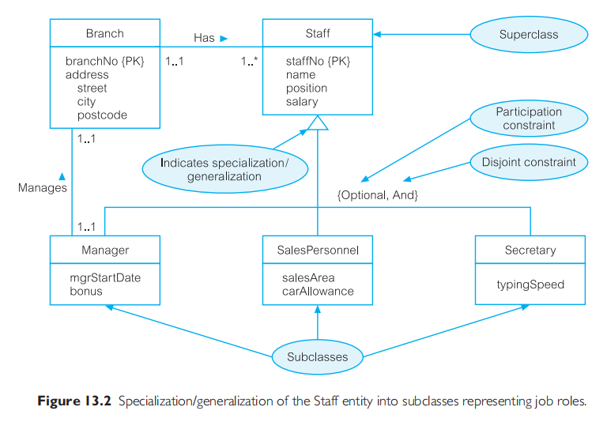
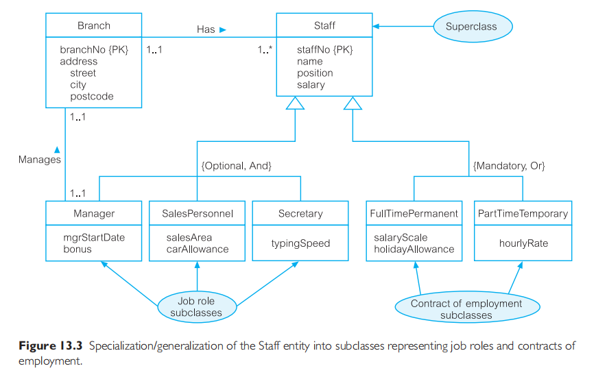
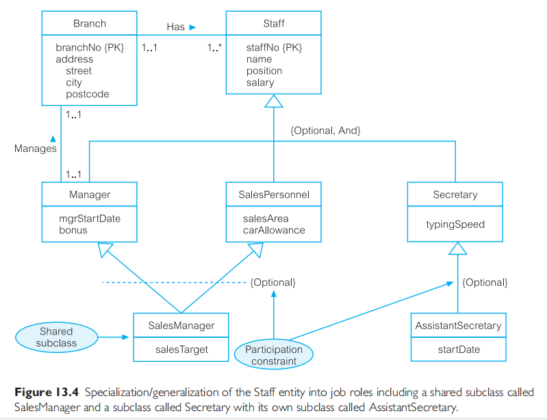
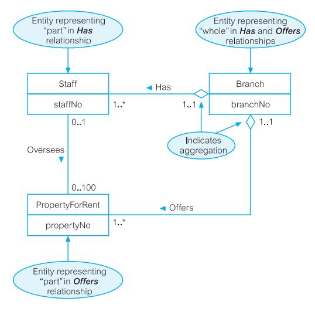
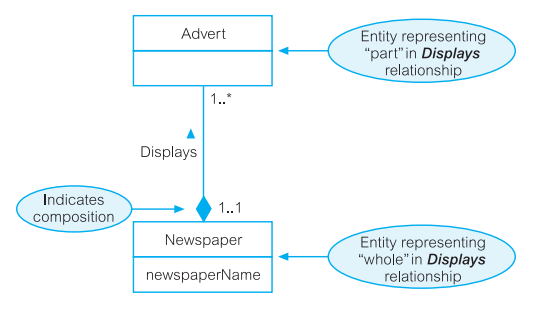

# Intro
**The basic concepts of ER modeling** 
- are normally <u>adequate for building data models of traditional, administrative-based database systems</u> such as stock control, product ordering, and customer invoicing. 
- They are often <u>insufficient to represent the requirements of the newer, more complex applications</u>, such as Computer-Aided Design (CAD), Computer-Aided Manufacturing (CAM), Computer-Aided Software Engineering (CASE) tools, Office Information Systems (OIS) and Multimedia Systems, Digital Publishing, and Geographical Information Systems (GIS).
  - One thing these complex applications have in common is **unstructured data**. Situations where **NoSQL solutions fit best**.
  - In face, SQL DBMS solutions have no way of implementing this concept.

**Three of the most important and useful additional concepts** of the EER model, are <u>specialization/generalization</u>, <u>aggregation</u>, and <u>composition</u>.

# Specialization/Generalization
The concepts of specializaton/generalization is <u>associated with</u> special types of entities known as **superclasses** and **subclasses**, and the process of **attribute inheritance**.

In addition, we have the two main types of <u>constraints on superclass/subclass relationships</u> called **participation** and **disjoint** constraints.

## Superclasses and Subclasses
They help us form entity types into a hierarchy.

> **Superclass**\
An <u>entity type that includes one or more dinstinct subgroupings of its occurences (subclass(es))</u>, which must be represented in a data model.

> **Subclass**\
<u>A dinstinct subgrouping of occurences of an entity type</u>, which must be represented in a data model.

For example in a company, the `Staff` entity type can be classified into <u>`Manager`, `SalesPersonel`, and `Secretaty` **subclasses**</u>. Hence, <u>the `Staff` entity is the **superclass**</u>.

The relationship between a superclass and any one of its subclasses is called a <u>**superclass/subclass relationship**</u>.

## Superclass/Subclass Relationships
The entity in the **subclass** is the <u>same entity in the superclass, *but with a **distinct role***</u>.

Some <u>superclasses may contain overlapping subclasses</u>, where a member of a superclass is also a member of more than one of its subclass. Also, <u>not every member of a superclass is necessarily a member of its subclass</u>.

We can use superclasses and subclasses to avoid describing different occurences of an entity type with possibly different attributes. 
- The unshared attributes would cause problems when we try to represent all these occurencies within this single entity type.
- We would have a relation with all possible attributes for all entity occurencies, with lots of tuples that have one or more attribute values to be empty. This is not good.

Two important reasons for introducing the concepts of superclasses and subclases into an ER model
- It avoids describing similar concepts more than once.
- It adds more semantic information to the design in a form that is familiar to many people.

## Attribute Inheritance
An entity in a subclass represents the same "real world" object in the superclass, and <u>may possess subclass-specific attributes, **as well as those associated with the superclass**</u>.

A subclass is an entity in its own right and so it may also have one or more subclasses. All these, form what we call a **type hierarchy**.

Type hierarchies are known by a variety of names, including **specialization hierarchy** (e.g. `Manager` is a specialization of `Staff`), **generalization hierarchy** (e.g. `Staff` is a generalization of `Manager`), and **IS-A hierarchy** (e.g. `Manager` IS-A (member of) `Staff`).

A subclass with more than one superclass is called a **shared subclass**.
- A member of a shared subclass must be a member of the associated suberclasses.
- The attributes of the superclasses are inherited by the shared subclass, which may also have its own additional attributes. This is referred to as **multiple inheritance**.

## Specialization Process
> **Specialization**\
The process of <u>maximizing the differences between members of an entity by identifying their distinguishing charasteristics</u>.

It is a *top-down approach* to defining a set of superclasses and their subclasses.
- We attempt to identify some distinguishing characteristics of the entities in the superclass.
- When we identify a set of subclasses of an entity type, we then associate attributes specific to each subclass, and also identify any relationships between each subclass and other subclasses.

## Generalization Process
> **Generalization**\
The process of <u>minimizing the differences between entities by identifying their common characteristics</u>.

It is a *bottom-up approach*, that results in the identification of a generalized superclass from the original entity types.
- We attempt to **identify similarities between the entity types**, such as common attributes and relationships.

The process of generalization can be viewed as the reverse of the specialization process.

> Diagrammatic representation of specialization/generalization

**Observations**
- triangle pointing at the `Staff` superclass, indicating specialization/generalization.
- the `Staff` superclass branches into `Manager`, `SalesPersonnel` and `Secretary` subclasses.
- [Generalization/specialization constraints](#constraints-on-specializationgeneralization). These are constraints on the relationship between the superclass and subclass. It includes Participation constraint (Optional | Mandatory) and Disjoint constraint (And | Or), taking the form `{Optional, And}`

We may have <u>**specializations of the same entity** based on **different distinguishing characteristics**</u>.

## Constraints on Specialization/Generalization
These are **participation constraints** and **disjoint constraints**.

> **Participation constraint**\
Determines <u>***whether*** every member in the superclass **must participate as a member of a subclass**</u>.

A participation constraint may be 
- **mandatory :** which specifies that every member in the superclass must also be a member of a subclass. OR 
- **optional :** which specifies that a member of a superclass need not belong to any of its subclasses.

> **Disjoint constraint**\
Describes the relationship between members of the subclasses and indicates <u>***whether*** it is possible for a member of a superclass **to be a member of one, or more than one, subclass**</u>.

The disjoint constraint <u>*only applies when a superclass has more than one subclass*</u>. **It is a constraint between the members of the subclasses of a superclass**.

If the subclasses are 
- **disjoint** ( `Or` ), then <u>an entity occurence can be a **member of *only one* of the subclasses**</u>, else if the subclasses are 
- **non-disjoint** ( `And` ), then <u>an entity occurence may be a **member of *more than one* subclass**</u>.

> See the below diagramatic representations.

# Aggregation
> **Aggregation**\
Represents a **"has-a"** or **"is-part-of"** <u>relationship between entity types</u>, <u>where **one represents the "whole"** and **the other the "part"**</u>.

Sometimes we want to **model** a "has-a" or "is-part-of" relationship, <u>in which **one entity represents a larger entity** (the "whole"), **consisting of smaller entities** (the "parts")</u>. This special kind of relationsip is called **aggregation**.

> Diagrammatic representation

We place an open diamond shape at one end of the relationship line, next to the entity that represents the "whole".

# Composition
> **Composition**\
A **specific form of aggregation** that represents an association <u>**between entities**, where **there is a strong ownership and coincidental lifetime** between the "whole" and the "part"</u>.

It is a variation of aggregation that represents a strong ownership and coincicental lifetime between the "whole" and the "part". <u>**The "whole"** is responsible for the disposition of the "parts",</u> which means that <u>the composition **must manage the creation and destruction of its "parts"**</u>. In other words, an object may be part of only one composite at a time.

Consider a composition, namely the <u>*`Displays`*</u> relationship, which relates the `Newspaper` entity to the `Advert` entity. As a composition, this emphasizes the fact that <u>an `Advert` entity (the "part") **belongs to exactly one** `Newspaper` entity (the "whole")</u>. This is in contrast to aggregation, in which a part may be shared by many whole.

> Diagrammatic representation of composition

We place a filled diamond shape at one end of the relationship line next to the entity that represents the "whole" in the relationship.

