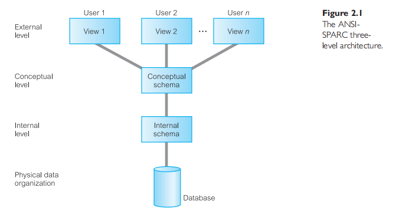
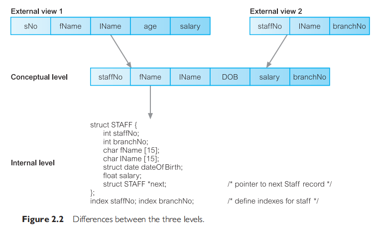
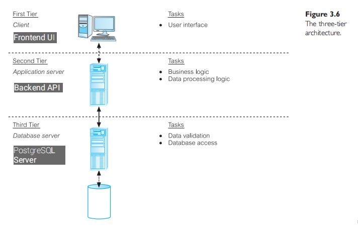

# Database Environment
The starting point for the design of a database must be an abstract and general description of the information requirements of the organization that is to be represented in the database.

## The Three-Level ANSI-SPARC Architecture
The ANSI-SPARC architecture (which is the architecture most commercial DBMSs available today is based, to some extent), identifies three distinct levels of abstraction at which data items can be described.
- The levels form a **three-level architecture** comprising 
  - an **external level** : this is the way your users perceive the data at the application level,
  - a **conceptual level** : this provides both the **mapping** (schema) and the desired **independence** between the external and internal levels,

  - and an **internal level** : this is the way the operating system perceives the data. The actual programming language code that represents your conceptual level data (your data definition schema using the DDL of your DBMS), translated by the DBMS software. That is the code your DBMS uses to speak to the computer to represent your schema in the computer storage. So your schema written in a DDL is converted to a data structre written in a programming language like, C.

### External Level
This level describes the **part of the database that is relevant to the user**.
- It **consists of a number of different external views of the database**. 
- Each user has **a view of the "real world" represented in a form that is familiar for that user**.
- The external view **includes <u>only those entities, attributes, and relationsips in the "real world" that the user is interested in</u>**.
- Different views may have **different representations of the same data**. 
- Some views might include **derived or calculated data**.

A familiar way to think about this is, the data names you use in your application frontend.

### Conceptual Level
This level describes **<u>what</u> data is stored in the database and the relationships among the data**.

This level contains **the logical structure (DB Schema) of the entire database as seen by the DBA or Backend Developer**.

It is **a complete view of the data requirements of the organization** that is independent of any storage considerations.

The conceptual level represents:
- all entities, their attributes, and their relationships;
- the constraints on the data;
- semantic information about the data;
- security and integrity information;

The conceptual level supports each external view, in that **any data available to a user must be <u>contained in, or derivable from</u>, the conceptual level (_the DB Schema_)**.

The DB Schema here is the one implemented using a DDL.

> The two levels above are your only concern. Don't bother about the last one. Except you want to create your own DBMS sofware.

### Internal Level
This level describes **<u>how</u> the data is stored in the database**.

This level contains the actual programming language code structure that speaks to your computer for file organization in the system running the DBMS software.

There's also a physical level that may be managed by the OS under the direction of the DBMS.

### Schemas, Mappings and Instances
The overall description of the database is called the **database schema**.

There are three different types of schema, each corresponding to the levels of abstraction.
- At the external level, we have *<u>multiple</u>* **external schemas** that correspond to the different view of the data.
- At the conceptual level, we have the **conceptual schema**, which describes all the entities, attributes, and relationships together with intergrity constraints.

- At the lowest level, we have the **internal schema**, which is a complete description of the internal model, containing the definitions of stored records, the methods of representation, the data fields, and the indexes and storage structures used. Usually implemented in a high-level language. **As before, you don't need to bother about this.**

*We can have **multiple external schemas**, when there is only one conceptual or internal schema per database.*

---

The DBMS is responsible for **mapping** the three levels together. It creates an external-conceptual mapping, and a conceptual-internal mapping.

---
**The data in the database at any particular point in time is called a <u>database instance</u>**. 

Many database instances can correspond to the same database schema. 

The <u>schema</u> is sometimes called the **intension** of the database; and <u>instance</u> is called an **extension** (or **state**) of the database.

### Data Independence
A major objective for the three-level architecture is to provide **data independence**, which means that <u>upper levels are unaffected by changes to lower levels</u>.

**Logical data independence:** External schemas are unaffected by changes in the conceptual schema.
- Addtion or removal of new entities, attributes, or relationships, should be possible without having to change existing external schemas or having to rewrite application programs.

**Physical data independence:** The conceptual schema is unaffected by changes in the internal schema.

## Data Models and Conceptual Modeling
A DDL used to write a schema, is too low level to <u>**describe the data requirements of an organization in a way that is readily understandable by a variety of users**.</u> What we requre is **a higher-level description of the schema**: that is, a **data model**.

An integrated <u>collection of concepts for describing and manipulating data, relationships between data, and constraints on the data</u> in an organization.

- A model is **a representation of real-world objects and events, and their associations**. 
- **It should provide the basic concepts and notations that will <u>allow database designers and end-users to communicate unambiguously and accurately their understanding of the organizational data</u>**.

A data model can be thought of as comprising three components:
- a **structural part**, consisting of <u>a set of rules according to which databases can be constructed;</u>
- a **manipulative part**, defining the types of operation that are allowed on the data.
- a **set of integrity constraints**, which ensures that the data is accurate.

The <u>purpose of a data model</u> is **to represent data and to make the data understandable**. *If it does this, then it can be easily used to design a database.*

Of the different data models we have, there are the only two you need to worry about:
- Entity-Relationship (ER) Model
- Relational Model

### Conceptual Modeling
The conceptual schema is the heart of the database. It should be a complete and accurate representation of the data requirements of the enterprise.

Our data modeling is targeted to the conceptual schema.

Conceptual modeling or conceptual database design is the process of constructing a model of the information used in an enterprise, that is independent of implementation details, such as the target DBMS, application programs, programming languages or any other physical considerations.

In simple terms, it is **the process of constructing <u>the model that would be used to write the conceptual schema, at the conceptual level</u>**.

> The conceptual model is independent of all implementation details, whereas <u>the logical model assumes knowledge of the underlying data model of the target DBMS</u>.

# Database Architectures and the Web
### Traditional Two-Tier Client-Server Architecture
Data-intensive business applications consist of four major components:
- the **database**,
- the **transaction logic**,
- the **business and data application logic**,
- and the **user**.

The traditional two-tier client-server architecture provides a very basic separation of these components. The Client (Tier 1) is primarily responsible for the *presentation* of data to the user, and the Server (Tier 2) is primarily responsible for supplying *data services* to the client.

A typical interaction between client and server is as follows.
- The client takes the user's request, checks the syntax, and generates databse requests in SQL or another database language appropriate to the application logic.
- It then transmits the message to the server, waits for a response, and formats the response for the end-user.
- The server accepts and processes the database requests, then transmits the results back to the client.

There's are problem with this architecture:
- A "fat" client, requiring considerable resources on the client's computer to run effectively. This includes disk space, RAM, and CPU power.
- A significant client-side administration overhead.

### Three-Tier Client-Server Architecture
This architecture solves the problem of enterprise scalability. Three layers:
- The user interface layer, which runs on the end-user's computer (the ***client***).
  - This is the first tier, your Frontend UI.
- The business logic and data processing layer. This middle tier runs on a server and is often called the ***application server***.
  - This is the second tier, your Backend API.
- A DBMS, which stores the data required by the middle tier. This tier may run on a separate server called the ***database server***.
  - This is the third tier, your PostgreSQL Server.

The three-tier design has many advantages over traditional two-tier or single-tier designs, which include:
- The need for **less expensive hardware** because the client is "thin".
- **Application maintanance is centralized** with the transfer of the business logic for many end-users into **a single application server**.
  - This eliminates <del>the concerns of software distribution</del> that are problematic in the traditional two-tier client-server model.
- The added modularity makes it **easier to modify or replace one tier without affecting the other tiers**.
- Load balancing is easier with the separation of the core business logic from the database functions.

**This is the model naturally used today.** It can even be extended into am $N$-tier Architecture.

### $N$-Tier Architectures
The three-tier architecture can be expanded to $n$ tiers, **with additional tiers providing more flexibility and scalability**.

This is where proxy servers come in. Providing features such as load balancing, content routing, caching etc.

### Middleware
Computer software that connects software components or applications.

These are technically **Message Passing IPC Softwares**.

**Example Categories:** Asynchronous RPC, Synchronous RPC, Publish/subscribe, Message-oriented middleware (MOM), Object-request broker (ORB), SQL-oriented data access.

### Transaction Processing Monitor
A major middleware for transaction processing.

TP Monitor, **a program that controls data transfer between client and database servers** *in order to provide a consistent environment*, particularly for online transaction processing (OLTP).

A TP Monitor, is a middleware that **provides access to the services of a number of resource managers and provides a uniform interface for programmers** who are developing transactional software.

Some features provided:
- Transaction routing,
- Managing distributed transactions,
- Load balancing,
- Funneling,
- Increased reliability

They are **typically used in environments with a very high volume of transactions**, where the TP Monitor can be used to offload processes from the DBMS server.

## Web Services and Service-Oriented Architectures
### Web Services
A software system designed to support interoperable machine-to-maching interaction over a network.

Examples are: 
- Microsoft Bing Maps and Google Maps
- Amazon Simple Storage Service (Amazon S3)

Application servers interact with these services using the REST API interface. Hence, they are RESTful web services.

### Service-Oriented Architectures (SOA)
A business-centric software architecture for building applications that implement **business processes as sets of services published at a granularity relevant to the service consumer**.

Examples are:
- Amazon Web Services
- Google Cloud Services
- Microsoft Azure

They combine different Web Services
