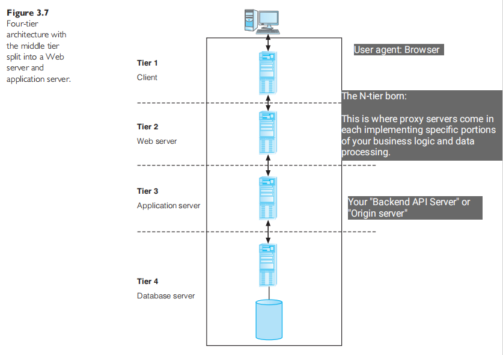
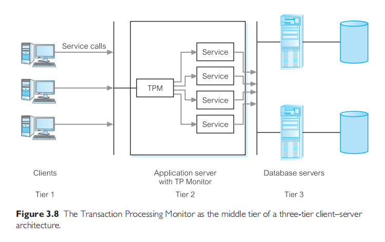

# Multi-User DBMS Architectures
## Traditional Two-Tier Client-Server Architecture
Data-intensive business applications consist of four major components:
- the **database**,
- the **transaction logic**,
- the **business and data application logic**,
- and the **user**.

The traditional two-tier client-server architecture provides a very basic separation of these components. The Client (Tier 1) is primarily responsible for the *presentation* of data to the user, and the Server (Tier 2) is primarily responsible for supplying *data services* to the client.

A typical interaction between client and server is as follows.
- The client takes the user's request, checks the syntax, and generates databse requests in SQL or another database language appropriate to the application logic.
- It then transmits the message to the server, waits for a response, and formats the response for the end-user.
- The server accepts and processes the database requests, then transmits the results back to the client.

There's are problem with this architecture:
- A "fat" client, requiring considerable resources on the client's computer to run effectively. This includes disk space, RAM, and CPU power.
- A significant client-side administration overhead.

## Three-Tier Client-Server Architecture
This architecture solves the problem of enterprise scalability. Three layers:
- The user interface layer, which runs on the end-user's computer (the ***client***).
  - This is the first tier, your Frontend UI.
- The business logic and data processing layer. This middle tier runs on a server and is often called the ***application server***.
  - This is the second tier, your Backend API.
- A DBMS, which stores the data required by the middle tier. This tier may run on a separate server called the ***database server***.
  - This is the third tier, your PostgreSQL Server.

The three-tier design has many advantages over traditional two-tier or single-tier designs, which include:
- The need for **less expensive hardware** because the client is "thin".
- **Application maintanance is centralized** with the transfer of the business logic for many end-users into **a single application server**.
  - This eliminates <del>the concerns of software distribution</del> that are problematic in the traditional two-tier client-server model.
- The added modularity makes it **easier to modify or replace one tier without affecting the other tiers**.
- Load balancing is easier with the separation of the core business logic from the database functions.

**This is the model naturally used today.** It can even be extended into am $N$-tier Architecture.

## $N$-Tier Architectures
The three-tier architecture can be expanded to $n$ tiers, **with additional tiers providing more flexibility and scalability**.

This is where proxy servers come in. Providing features such as load balancing, content routing, caching etc.

## Middleware
Computer software that connects software components or applications.

These are technically **Message Passing IPC Softwares**.

**Example Categories:** Asynchronous RPC, Synchronous RPC, Publish/subscribe, Message-oriented middleware (MOM), Object-request broker (ORB), SQL-oriented data access.

## Transaction Processing Monitor
A major middleware for transaction processing.

TP Monitor, **a program that controls data transfer between client and database servers** *in order to provide a consistent environment*, particularly for online transaction processing (OLTP).

A TP Monitor, is a middleware that **provides access to the services of a number of resource managers and provides a uniform interface for programmers** who are developing transactional software.

Some features provided:
- Transaction routing,
- Managing distributed transactions,
- Load balancing,
- Funneling,
- Increased reliability

They are **typically used in environments with a very high volume of transactions**, where the TP Monitor can be used to offload processes from the DBMS server.

# Web Services and Service-Oriented Architectures
## Web Services
A software system designed to support interoperable machine-to-maching interaction over a network.

Examples are: 
- Microsoft Bing Maps and Google Maps
- Amazon Simple Storage Service (Amazon S3)

Application servers interact with these services using the REST API interface. Hence, they are RESTful web services.

## Service-Oriented Architectures (SOA)
A business-centric software architecture for building applications that implement **business processes as sets of services published at a granularity relevant to the service consumer**.

Examples are:
- Amazon Web Services
- Google Cloud Services
- Microsoft Azure

The SOA consists of <u>loosely coupled and autonomous *web services* that can be combined to provide flexible composite business processes and applications</u>.
- The provision of **the web service is independent of the application using the service**. Service providers can develop specialized services and offer these to a range of service users from different organizations.

What makes Web services designed for SOA different from other Web services is that they typically follow a number of distinct conventions. \
<u>Here are a set of common SOA principles for its Web services design:</u>
- Loose coupling
- Reusability
- Contract
- Abstraction
- Composability
- Autonomy
- Stateless
- Discoverability
