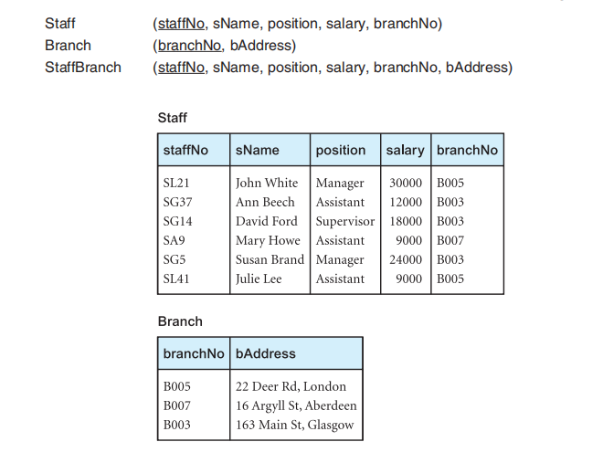
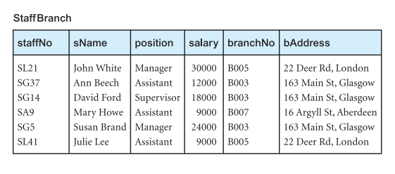
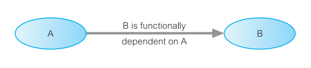
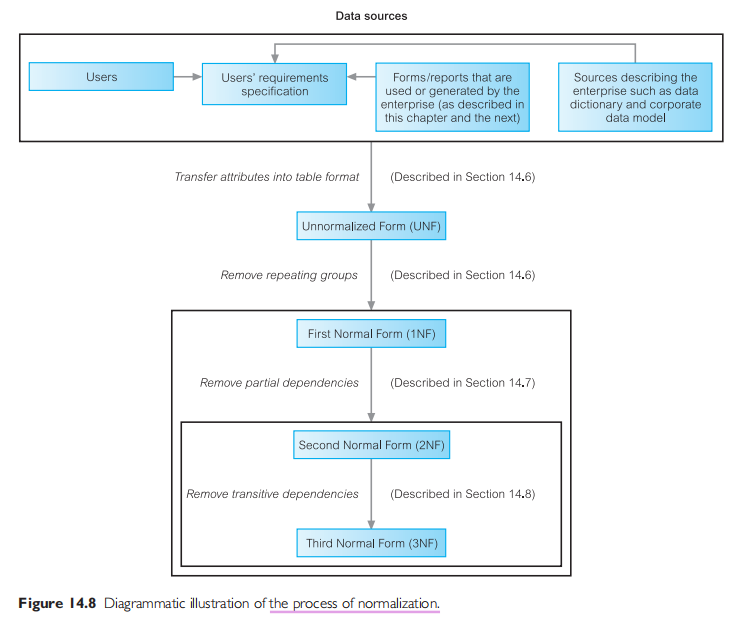

# Intro
When we design a database for an enterprise, the main objective is to create an accurate representation of the data, relationships between the data, and constraints on the data that is pertinent to the enterprise.

Normalization is a database design technique that begins by <u>examining the relationships</u> (called functional dependencies) <u>between attributes</u>.
- Normalization uses <u>a series of tests</u> (described as **normal forms**) <u>to help</u> **identify the optimal grouping for these attribtues** <u>to ultimately identify a set of suitable relations</u> that supports the data requirements of the enterprise.

# The Purpose of Normalization
> **Normalization**\
A technique for producing a set of relations with desirable properties, given the data requirements of an enterprise.

The purpose of normalization is **to identify a suitable set of relations that support the data requirements of an enterprise**. The <u>characteristics of this suitable set of relations</u> include:
- the minimal number of attributes necessary to support the data requirements of the enterprise
- <u>attributes with a close logical relationship</u> (described functional dependency) are <u>found in the same relation</u>. 🎯
- minimal redundancy, i.e. each attribute represented only once, with the important <u>exception of attributes that form all or part of foreign keys</u>. 🎯

# Data Redundancy and Update Anomalies
A major aim of relational database design is to group attributes into relations to minimize data redundancy.

The only data redundancy we need to retain are copies of foreign keys for establishing relationships between relations.

Relations that have redundant data may have problems called <u>update anomalies</u>, which are classified as **insertion**, **deletion**, or **modification** anomalies. 🎯

> A normalized table instance

> An unormalized table instance

**Observations:** <u>Clues for where we may need to decompose the table</u>. 🎯
- Observe repeating non-foreign-key attribute values that refer to the same real world object or concept, and subject to change. Any repeating real world object or concept attribute should only be the foreign key attribute(s) that references the home relation.
- Observe attribute(s) that make up a separate real world object or concept that can and should exist independently in its own relation. e.g. `branchNo` and `bAddress`. Attributes in a relation should be the sole real world properties of that relation, that is not perceived to be a separate real world object or concept.
- Every real world object or concept should have its own relation to itself.

## Insertion Anomalies

> Observing the unormalized table.

There are of two main types of insertion anomalies. 🎯
- to insert the details of new staff located at Branch `B007`, we must always enter the correct details of Branch `B007` so that the branch details are consistent with values for Branch `B007` in other tupes of the `StaffBranch` relation. Those details are unnecessary redundancies.
- to insert details of a new branch that currently has no members of staff into the `StaffBranch` relation, it is necessary to enter nulls into the attributes for staff, such as `staffNo`. However, as `staffNo` is the primary key for the `StaffBranch` relation, attempting to enter nulls for `staffNo` violates entity integrity, and is not allowed. We therefore cannot enter a tuple for a new branch into the `StaffBranch` relation with a null for the `staffNo`.

**Note that**, the design of the normalized tables avoids these problems.

## Deletion Anomalies
> Observing the unormalized table.

If we delete a tuple from the `StaffBranch` relation that represents the last member of staff located at a branch, the details about that branch are also lost from the database. 🎯

**Note that**, the design of the normalized tables avoids these problems.

## Modification Anomalies
> Observing the unormalized table.

If we want to change the value of one of the attributes of a particular branch in the `StaffBranch` relation, for example, the address for Branch `B003`, we must update the tuples of all staff located at that branch. If this modification is not carried out on all the appropriate tuples of the `StaffBranch` relation, the database will become inconsistent. 🎯

**Note that**, the design of the normalized tables avoids these problems.

There are **two important properties associated with decomposition** of a larger relation into smaller relations:
- The **lossless-join** property ensures that <u>any instance of the original (unormalized) relation can be identified from correspoinding instances in the smaller (normalized) relations</u>.
- The **dependency preservation** property esures that <u>a constraint on the original (unormalized) relation can be maintained by simply enforcing some constraint on each of the smaller (normalized) relations</u>. Thus, we do not need to perform joins on the smaller relations to check whether a constraint on the original relation is violated.

# Functional Dependencies
An important concept associated with normalization is **functional dependency**, which <u>describes the relationship between attributes</u>.

## Characteristics of Functional Dependencies

> **Functional dependency**\
Describes **the realtionship between attributes in a relation**. For example, if `A` and `B` are attributes of relation `R`, `B` is functionally dependent on `A` (denoted `A ® B`), if <u>each value of `A` is associated with exactly one value of B</u> (`A` and `B` may each consist of one or more attributes). 🎯

Functional dependency is a property of the meaning or semantics of the attributes in a relation. The semantics indicate how attributes relate to one another, and specify the functional dependencies between attributes.

Consider a relation with attributes `A` and `B`, where attribute `B` is functionally dependent on attribute `A`. If we know the value of `A` and we examine the relation that holds this dependency, <u>we find only one value of `B` in all the tuples that have a given value of `A`, at any moment in time</u>. **Thus, when two tuples have the same value of `A`, they also have the same value of `B`**. <u>However,</u> for a given value of `B`, there may be several different values of `A`.
- > Say we execute a `SELECT` query on a relation `WHERE A = someValue`, <u>it'll always return exactly one row</u> with the same value of `B`. There's a one-to-one relationship between the two attributes.
- > However, if you go the other way round, `WHERE B = someValue`, it may return more than one row with different values of `A`. There's a one-to-many relationship between the two attributes. <u>This isn't what we want</u>.

An alternative way to describe the relationship between attributes `A` and `B` is to say that **"`A` functionally determines `B`"**.

> **Determinant**\
Refers to the attribute, or group of attributes, on the left-hand side of the arrow of a functional dependency.

> Observing the unormalized table

A member of staff holds one position; 
- suppose we query a staff's `position` using `staffNo`, we always get exactly one `position` value for a specific `staffNo`. (`1:1`) ✅

however, there may be several members of staff with the same position.
- now suppose we query a staff's `staffNo` using `position`, we may get more than one `staffNo` value for a specific `position`. (`1:*`) ❌

The relationship between `staffNo` and `position` is one-to-one (`1:1`), i.e. for each staff number there is only one position. On the other hand, the relationship between `position` and `staffNo` is one-to-many (`1:1`), i.e. there are several staff numbers associated with a given position.
- **For the purposes of normalization**, <u>we are interested in identifying functional dependencies between **attributes of a relation that have a *one-to-one* relationship** between the attribute(s) that makes up the determinant on the LHS and the attribute(s) on the RHS of a dependency</u>. 🎯

When identifying functional dependencies between attributes in a relation, it is important to distinguish clearly between, <u>the values held by an attribute at a given point in time</u> ❌, and <u>the set of all possibe values than an attribute may hold at different times</u> ✅.
- **For the purposes of normalization**, <u>we are interested in identifying **attribute(s) containing a set of all possible values** for the attribute(s)</u>. Recall that, this is the form that foreign keys usually take, as they'll always contain a value that's from the primary key set of their owner relation. Thus, if this attrbute(s) is not a foreign key, we should decompose it into its own relation. 🎯

**An addtional characteristic of functional dependencies that is useful for normalization** is that <u>their determinants should have the minimal number of attributes necessary to maintain the functional dependency</u> with attribute(s) on the RHS. This requirement is called **full functional dependency**.

> **Full functional dependency**\
Indicates that if `A` and `B` are attributes of a relation, `B` is fully functionally dependent on `A` if <u>`B` is functionally dependent on `A`, but not on any proper subset of `A`</u>. ✅

A functional dependency `A ® B` is a full functional dependency if the removal of any attribute from `A` (`A` being a composite) results in the dependency no longer existing. ✅

A functional dependency `A ® B` is a partial dependency if there is some attribute that can be removed from `A` and yet the dependency still holds. ❌

The type of functional dependency that we are interested in identifying is a full functinal dependency.

In summary, the functional dependencies that we use in normalization have the following characteristics:
- There is a one-to-one relationship between the attribute(s) on the LHS (determinant) and those on the RHS of the functional depencency.
- They hold for all time.
- There must be a full functional dependency between the attribute(s) on the LHS and RHS of the dependency.

# Process of Normalizaton
The technique involves a series of rules that can be used to test individual relations so that a database can be normalized to any degree.

When a requirement is not met, the relation violating the requirement must be decomposed into relations that individually meet the requirements of normalization.

- First normal form (1NF) : Remove repeating groups
- Second normal form (2NF) : Remove partial dependencies
- Third normal form (3NF) : Remove transitive dependencies
- Others: BCNF, 4NF, 5NF, 6NF.

**With the exception of 1NF**, <u>all these normal forms are based on functional dependencies among the attributes of a relation</u>.

Normalization is often executed as a series of steps. <u>Each step corresponds to a specific normal form</u> that has known properties.
- As normalization proceeds, the relations become progressively more restricted (stronger) in format and also less vulnerable to update anomalies.
- **We begin by**, extracting information about attributes from sample forms that are first transformed into table format, which is described as being in Unnormalized Form (UNF). This table is then subjected progressively to the different requirements associated with each normal form until ultimately the attributes shown in the original sample forms are represented as a set of 3NF relations. 
- The above is a bottom-up technique. In simple-to-moderate projects you'll often use a top-down approach, where you first create normalized relations using common-sense, and then use normalization to do final checking and correction.

---
---

> My thoughts

> **<u>What is Normalization?</u>**

Normalization is the technique of **decomposing a single relation (table) into multiple relations (tables) and *connecting them via relationships***, to *mizimize redundancy and avoid update anomalies (Insertion, Deletion and Modificaition)*.

Normalization can be achieved by 
- **careful examination of where update anomalies may occur** in a relation, and decomposing the relation accordingly. ***Why?*** Because, the whole point of normalization is to prevent update anomalies.
- Use the clues designated 🎯, in the above sections. They'll give you insight as to where to decompose tables.
