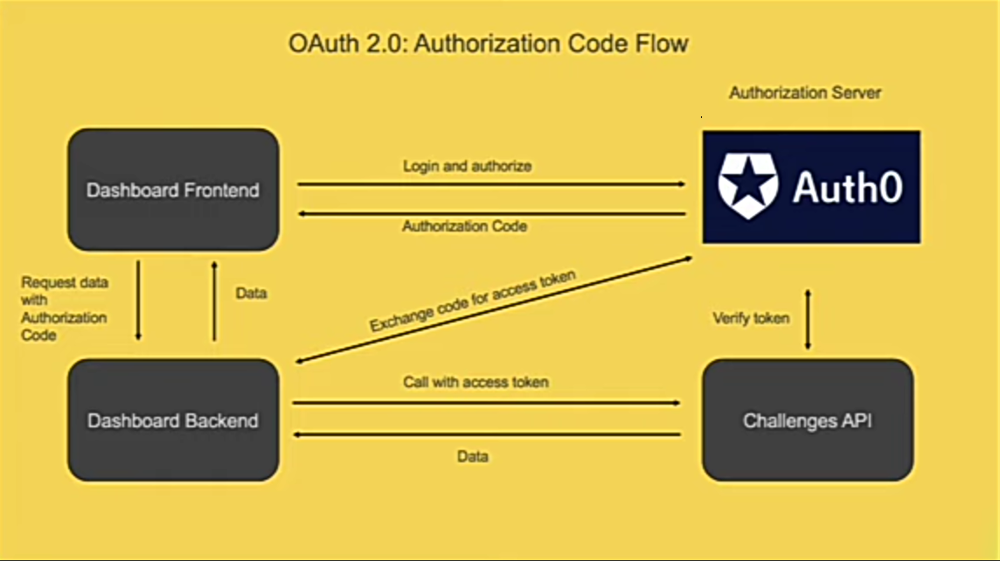

# Introduction
OAuth is the technique you use when you want third-party apps to integrate with your API, to serve its functionalities to the users of your API.\
It is used to provide third-party apps authorized read/write access to your users data.\
All these without your users having to share their passwords with these third-party apps.
- **No password sharing:** This is unlike Basic Auth where you have to share your password with the third-party apps.
- **Revoke access to applications individually:** This is unlike Basic Auth where changing your API password, revokes access to *all* the third-party APIs you've granted access to.
- **Control over the resources the third-party APIs can access:** This is unlike Basic Auth where the third-party apps have read/write access to all your data. *That's a risk!*

# How it'll work
## Authorization
1. The implementation provides to the third-party apps a `callback URL`(Redirect URI) to your authorization server, with `Response type` and `Scopes` information in the payload.

2. Once the request is initiated, the authorization server prompts the user to consent to the providing access. The authorization server then responds with an **authorization code**.

3. Next, the *"third-party's backend"* then makes a request to the authorization server again, with this authorization code in exchange for an **access token**. *This is for security purposes, since the authorization code is exposed on the frontend. In addition, this exchange is done in a secure manner. There's a secret key only the third-party backend and authorization server only knows*.

4. Finally, the *"third-party's backend"* then uses this access token to request read/write access to user's data in your API.

> This implementation is only meant for authorization, not authentication. But, third-party apps wants to get access to user information in order to authenticate users into their apps.\
> Unfortunaley, this implementation (access tokens) does not provide user information, and developers have to hack their way through.\
> **Hence, comes an improvement to OAuth to allow authentication.**

## Authenticaton
**OpenID Connect:** Allows clients to verify the identity of end-users and get basic profile information about them.
> **How it works:**

- In step 1: In the `Scopes` information sent by the third-party frontend during the `callback URL` request, we specify `openid` as part of the access scopes.
- In step 3: When the backend exchanges the authorization code with the authorization server, this time it'll be for both an **access token**(for authorization) and an **ID token**(for authentication - user info).
- In step 4: both tokes are passed to your API to provide *user information* and *the necessary access rights*.

---
---

> **Some properties/terms explained:**

**Scopes:** This is used to control a third-party application's access to user data. It specifically, allows the third-party app to list the access rights to be granted by your API.
- Your API should have enough scopes to protect sensitive information.
- Ensure that you have have scopes for different kinds of resources. Don't give read/write access to all resources.

**Refresh tokens:** This allows access tokens to be renewed.
- It adds additional layer of security.
- The user doesn't have to re-authenticate without explicitly logging out.
- It generates a new access token automatically. The user doesn't have to handle an expired session.
- **How it works:**
  - If you have set an expiration for the access token, in step-3, the tp-backend will exchange the authorization code to include both an **access token** and a **refresh token**.
  - The tp-backend will normally use the unexpired access token to make requests to your API, then when the access token expires, it exchanges with the authorization server a refresh token for a **new access token**.
  - Finally, the new access token is used to send requests to your API.

---

# Implementation
## Code flow

## Practical
1. **Setup an Authorization server for your API using Auth0:** This is for your API that will be consumed by third-party apps.
    - Create an Account with Auth0 and get to the configuration interface.
    - Switch to the APIs tab and Click create API.
    - Give a **name** to your API, give an **identifier**(an address that references your Authorization Server) to your API. Finally, click **create**.
    - Go to the inner settings tab. Turn on both RBAC settings. Click save.
    - Go to the permisssions inner settings tab: This is where you setup your API scopes.
    - *Check the video to for more setup details...*

2. Configure a third-party app to communicate with your API that has implemented OAuth config.
    - *Check the video to for setup details...*