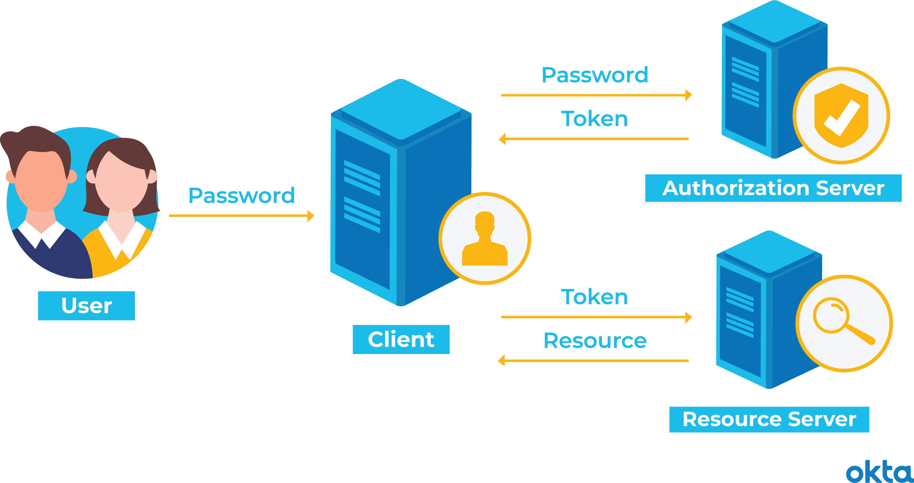
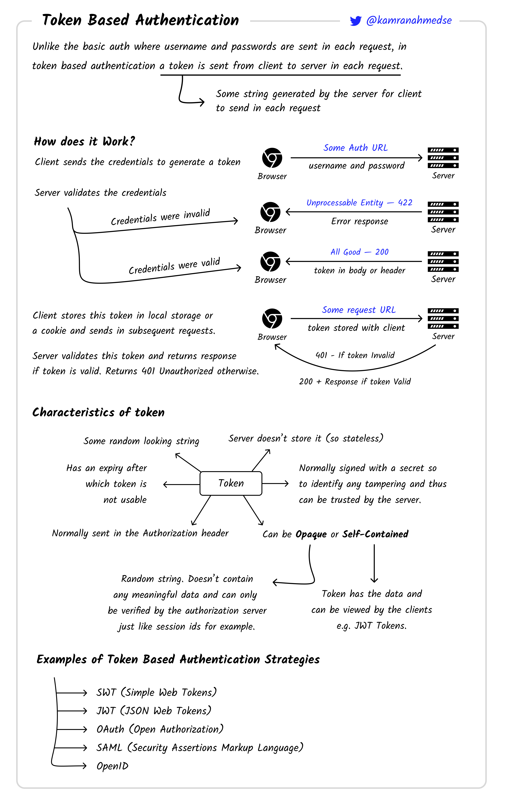

# Intro
Token-based authentication is a protocol which allows users to verify their identity, and in return receive a unique <u>access token</u>. 
- During the life of the token, users then access the website or app that the token has been issued for, <u>rather than having to re-enter credentials each time</u> they go back to the same webpage, app, or any resource protected with that same token.
- **The user retains access as long as the token remains valid**. Once the user logs out or quits an app, the token is invalidated.

With token authentication, <u>a secondary service verifies a server request</u> (Login). When the <u>verification is complete, **the server issues a token as it responds to the request**</u>.
- The user may still have one password to remember, but the token offers another form of access that's much harder to steal or overcome. And the session's record takes up no space on the server.

> Generating an access token, is the tedious aspect of this authentication, but luckily we have token-auth libraries that has taken care of this step.

# 3 Authentication Token Types
In all three of these scenarios, a user must do something (provide credentials for verification), to start the process. But even when they complete those preliminary steps perfectly, they can't gain access without the help of an access token.
- **Connected:** Keys, discs, drives, and other physical items plug into the system for access. e.g. a USB device or smartcard to log into a system.
- **Contactless:** A device is close enough to a server to communicate with it, but it doesn't plug in. e.g. Microsoft's "magic ring".

- **Disconnected:** A device can communicate with the server across long distances, even if it never touches another device at all. e.g. Google's 2FA with my Android device.

# Token Auth in 4 Easy Steps
Use a token-based authentication system, and <u>visitors will verify credentials just once</u>. In return, they'll get a token that allows access for a time period you define.

The process works like this:
- **Request:** The person asks for access to a server or protected resource. i.e. User login.
- **Verification:** The server determines that the person should have access. i.e. User login successful.
- **Tokens:** The server commnunicates with the authentication device, like a ring, key, phone, or similar device. After verification, the server issues a token - `jwt.sign({})` - and passes it to the user. 

- **Storage:** The token sits within the user's browser while work continues.

If the user attempts to visit a different part of the server, the token communicates with the server again. Access is granted or denied based on the token validity.

**Administrators set limits on tokens**. You could allow a one-use token that is <u>immediately destroyed when the person logs out</u>. Or you could set the token to <u>self-destruct at the end of a specified time period</u>.

