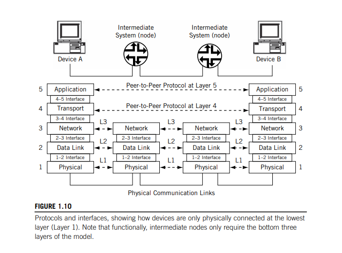
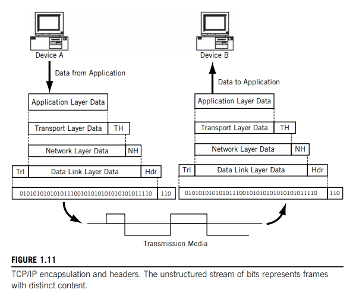

# Protocols and Layers

## Layers

Data communication networks rely on *layered* protocols.

<u>Processes running on a system</u> and the communication ports that send and receive network bits <u>are logically connected by a series of layers</u>, <u>each performing one major function of the networking task.</u>

Each layer in the protocol stack has a distinct purpose and function. Each protocol layer handles part of the overall task.

### Protocol Layers

Each layer has a separate function in the overall task of moving bits between processes.

As long as the boundary functions between adjacent layers are respected, **(due to the decoupled nature)** 👉 layers can be changed or even completely rewritten without having to change the whole application. <u></u>Layers can be combined for efficiency, "mixed-and-matched" from different vendors, or customized for different circumstances, all without having to rework the entire stack from top to bottom.

## The TCP/IP Protocol Suite

The protocol stack used on the Internet is the Internet Protocol Suite. <u>It is usually called TCP/IP after two of its most prominent protocols, but there are other protocols as well</u>.

The TCP/IP model <u>is based on a five-layer model for networking</u>. From bottom (the link) to top (the user application), these are

- the physical,
- data link,
- network,
- transport, and
- application layers.

Not all layers are completely defined by the model, so these layers are “filled in” by external standards and protocols.

Two compatible end-system applications can communicate regardless of their underlying architectures, although the connections between layers are not defined.

The TCP/IP layers contain relatively independent protocols that can be used <u>depending on the needs of the system to provide whatever function is desired</u>. For example, there are different application layer protocols each providing the system with specific functionality and/or behaviour.

### The TCP/IP Layers

The Internet protocol suite assumes that a layer is there and available, so TCP/IP does not define the layers themselves. *The stack consist of protocols, not implementations, so describing a layer or protocols says almost nothing about how these things should actually be built*.

<u>Not all systems on a network need to implement all five layers of TCP/IP.</u> **Devices using the TCP/IP protocol stack fall into two general categories**: *a host* or *end system* (ES) and an *intermediate node* (often a router) or an *intermediate system* (IS).
<u>The intermediate nodes usually only involve the first three layers of TCP/IP.</u>

Each implemented layer has an *interface* with the layers above and below it (except for the application and physical layers, of course) and provides its defined service to the layer above and obtains services from the layer below. In other words, <u>there is a *service interface* between each layer,</u> *but these are not standardized and vary widely by operating
system.*

Individual layers can be combined for implementation purposes, *as long as the service interfaces to the layers remain intact*. <u>Layers can even be split when necessary, and new service interfaces defined.</u> Services are provided to the layer above after the higher layer provides the lower layer with the command, data, and necessary parameters for the lower layer to carry out the task.

Layers on the same system provide and obtain services to and from adjacent layers. However, <u>a *peer-to-peer protocol process* allows the same layers on different systems to communicate</u>. The term peer means every implementation of some layer is essentially equal to all others. Communications between peer layers on different systems use the defined protocols appropriate to the given layer.

In other words, ***services*** refer to <u>communications between layers within the same process,</u> and ***protocols*** refer to <u>communications between processes.</u>

### Protocols and Interfaces

It is important to note that <u>when the layers of TCP/IP are on different systems, they are only connected at the physical layer.</u> *Direct peer-to-peer communication between all other layers is impossible.* This means that <u>all data from an application have to flow “down” through all five layers at the sender, and “up” all five layers at the receiver to reach the correct process on the other system.</u> These data are sometimes called a *service data unit* (SDU).

Each layer on the sending system adds information to the data it receives from the layer above and passes it all to the layer below (except for the physical layer, which has no lower layers to rely on in the model and actually has to send the bits in a form appropriate for the communications link used).

Likewise, each layer on the receiving system unwraps the received message, often called a *protocol data unit* (PDU), with each layer examining, using, and stripping off the information it needs to complete its task, and passing the remainder up to the next layer (except for the application layer, which passes what’s left off to the application program itself).

As shown in the figure,

- there is a natural grouping of the five-layer protocol stack at the network layer and the transport layer.
- <u>The lower three layers of TCP/
IP, sometimes called the *network support layers*, must be present and functional on all systems, regardless of the end system or intermediate node role.</u>
- The transport layer links the upper and lower layers together. This layer can be used to make sure that what was sent was received, and what was sent is useful to the receiver.

The process of encapsulation makes the whole architecture workable. <u>**Encapsulation of one layer’s information inside another layer is a key part of how TCP/IP works.**</u>

### Encapsulation

Each layer uses encapsulation to add the information its peer needs on the receiving system.

- The network layer adds a header to the information it receives from the transport at the sender and passes the whole unit down to the data link layer.
- At the receiver, the network layer looks at the control information, usually in a *header*, in the data it receives from the data link layer and passes the remainder up to the transport layer for further processing.
- This is called encapsulation because one layer has no idea what the structure or meaning of the PDU is at other layers. *The PDU has several more or less official names for the structure at each layer.*

The exception to this general rule is the data link layer, which adds both a *header* and a *trailer* to the data it receives from the network layer. The general flow of encapsulation in TCP/IP is shown above.

- Note that on the transmission media itself (or communications link), there are only bits, and that some
“extra” bits are added by the communication link for its own purposes.
- Each PDU at the other layers is labeled as data for its layer, and the headers are abbreviated by layer name.
- The exception is the second layer, the data link layer, which shows a header and trailer added at that level of encapsulation.

## The layers of TCP/IP

Personally, I've decided not to consider all layers, except the ones that are key to my area of specialization.

