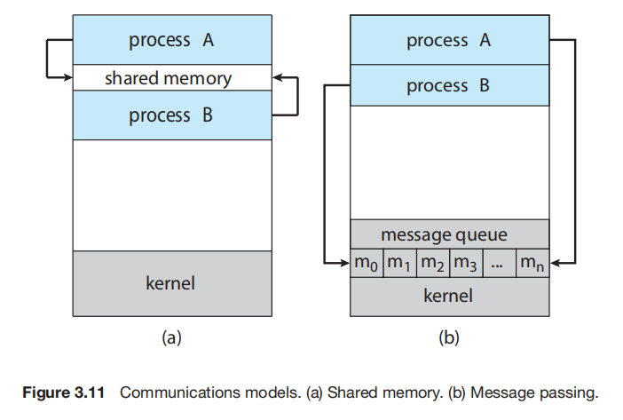

# Intro
IPC is **the mechanism that allows processes to exchange data**.

There are two fundamental models of IPC: 
- **shared memory**: <u>a region of memory that is shared</u> by the communicating processes is established.
- and **message passing**: communicating processes <u>exchange messsages</u> between them.

# IPC in shared memory systems
Using this technique, requires communicating processes to establish a region of shared memory. A shared memory segment is created by one of the communicating processes in its address space. Other processes that wishes to communicate must attach it to their address space.

Communicating procecesses must agree to remove the restriction that the operating system places on one process accessing the memory of another process.

The processes communicate by writing and reading data in the shared memory, which is visible to communicating processes.

An example of this technique, is the producer-consumer problem, where the producer process writes (produces data) to the shared memory, and the cosumer process read (consumes data) from the shared memory.

To allow the producer and consumer processes to run concurrently, a buffer resides in this region of shared memory. The producer fills the buffer with data items, and the consumer empties the buffer of data items.

The producer and consumer must be synchronized, so that 
- the producer must wait when the buffer is full (bounded buffer),
- the consumer must wait when the buffer is empty, 
- and most especially <u>the processes must not access the shared memory while one is still at work, one must wait for the other to finish performing its *producing* or *consuming* operation</u>.
  - Normally, only one process can be "running" at one time, let's say this time it's the producer process, but if the operating system context-switches to the consumer process while the producer process has not yet finished producing, the consumer process will be trying to access no data. We don't want this. Hence, the need for a synchronization mechanism between these processes.

Two types of buffer can be used:
- Bounded buffer: This type of buffer has a size limit, the producer must wait if the buffer is full, and the consumer must wait if the buffer is empty.
- Unbouded buffer: This type of buffer has no size limit, the producer can keep putting data items into the buffer, but the consumer must still wait if the buffer is empty.

The buffer management, process synchronization and all other operations involved in shared memory communication, is handled by the application programmer.

# IPC in message passing systems
In this technique, the operating system provides the means for cooperating processes to communicate via message-passing.

**Message passing provides a mechanism to allow processes to communicate and to synchronize their actions without sharing the same address space**. It is particularly useful in a distributed environment, where the communicating proceses may reside on different computers connected by a network.

If two processes must *send messages to and receive messages from* each other, <u>a **communication link** must exist</u> between them.

> Methods for implementing the communication link:
- Direct or Indirect communication
- Synchronous or asynchronous communication
- Automatic or explicit buffering