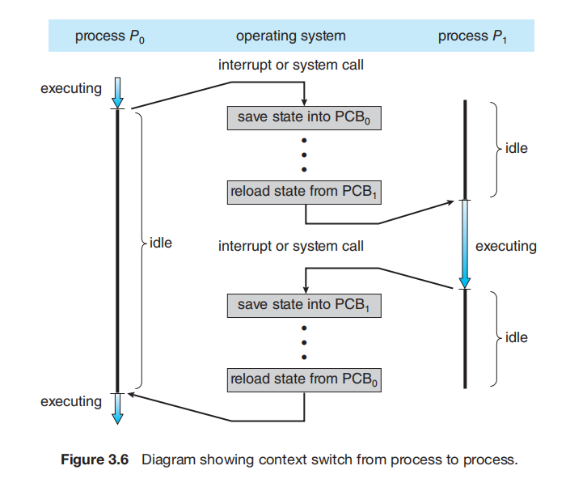
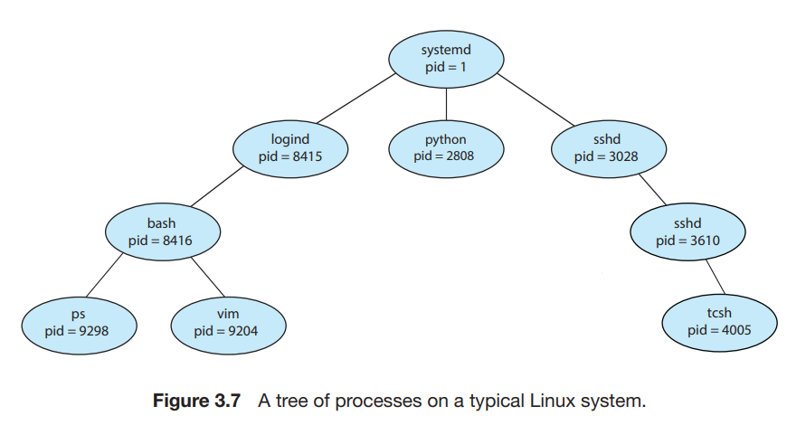

# ----- Study One -----
# Processes
A process is an instance of a program in execution located in memory. It makes the program feel it has exclusive use of the systems resources.

Each time a user runs a program, the OS creates a new process and runs this program in the context of that process.

Each process have **an independent logical control flow** (_independent program counters_) that provides the illusion that its program has exclusive use of the processor.

## Logical flow

If we were to step through the execution of our program, we would observe a series of program counter values that corresponded exclusively to instructions contained in our program's executale object file or in shared objects linked into our program dynamically at run time. This sequence of PC values is known as the *logical control flow*.
- It'd seem as if the program counter has only been addressing this process instructions, whereas it done for other processes instructions too.
- Processes takes turns using the processor. Each process executes a portion of its flow for a certain amount of time (this time period is called a _time slice_) and is temporarily suspended while others take their turns.
- When one process suspends the, current values of its program counter is saved into its state (along with other values) before another process takes its turn, when this process resumes, the current value of its program counter is restored into the program counter in the processor, and execution continues.

## Concurrent Flows

The general phenomenon of multiple flows executing concurrently is known as _concurrency_. The notion of a process taking turns with other processes is also known as _multitasking_. Each time period that a process executes a portion of its flow is called a _time slice_. Thus, multitasking is also referred to as _time slicing_.

If two flows overlap in time, then they are concurrent, even if they are running on the same processor.

If two flows are _running concurrently on different processor cores_ or computers, then **they are running in parallel**, and have **parallel execution**.

---

Each process also have **a private address space** that provides the illusion that its program has exclusive use of the main memory.

## Private Address Space

A process provides each program with its own *private address space*. Not to be addressed by any other process.

Each address space has the same general organization.
- The bottom portion is reserved for the user program.
- The top portion is reserved for the kernel.
- An address space contains:
  - Code segment and Data segment, loaded from the executable file
  - The runtime heap, created by `malloc`
  - User stack created at runtime, used by function calls.
  
  
  <u>*The memory layout of a process.*</u>

## User and kernel modes

A mechanism that restricts the instructions that a program can execute, as well as the portions of the address space that it can access.

A process running in kernel mode can execute any instruction in the instruction set and access any memory location in the system.

A process running in user mode is not allowed to execute priviledged instructions which only the OS is allowed to access. It is also not allowed to directly reference code or data in the kernel area of its address space, any such attempt throws a protection fault. **User programs must instead access kernel code and data indirectly via the system call interface**.

The only way for a process to change from user mode to kernel mode is to trigger an exception.
- When exception occurs and control is passed to the exception handler, the processor changes the mode from user mode to kernel mode. This is because exception handlers run only in kernel mode.
- When it returns to the application code, the processor changes the mode from kernel mode back to user mode.

Note: Modes are associated with processes, not with the CPU.

## !Context Switches!

The *OS kernel implements multitasking* using a form of exceptional control flow known as a _context switch_.

The kernel maintains a <u>*context*</u> for each process.
- The context is **the state that the kernel needs to restart a preempted process**.
- <u>*It consists of*</u> ***the values of objects*** such as
  - general-purpose registers, 
  - the floating-point registers, 
  - the program counter, 
  - user's stack, 
  - status registers, 
  - kernel's stack, 
  
  and *various kernel data structues* such as 
  - a page table that characterizes the address space, 
  - a process table that contains information about the current process, and 
  - a file table that containis information about the files that the process has opened.

- The *<u>stateful component part that a process uses to run</u>* is referred to as its ***context***. Stateful in the sense that, they can take different values at different times.
  - Saving a context's state therefore means, saving the current values each component has before context switching. More like, pinning the values down, pausing them from changing.
  - And, resuming the context is like, pressing play on the paused state.

- The context is also known as *Process Control Block* (PCB).

At certain points during the execution of a process, the *kernel can decide to preempt the current process and restart a previously preempted process*. This decision is known as **process scheduling**, and is handled by code in the kernel, called the **scheduler**.
- When the kernel selects a new process to run, we say that the kernel has **scheduled** that process.
- After this, it preempts the current process and transfers control to the new process using a mechanism called **context switching**, 
- *Context switching* goes thus,
  - save the context of the current process,
  - restore the saved context of some previously preempted process, and
  - pass control to this newly restored process.

A context switch can occur while the kernel is executing a system call on behalf of the user. If the system call blocks because it is waiting for some event to occur, then the kernel can suspend the current process and switch to another process.
- For example, if a process is waiting for response data to arrive on the network adapter. Instead of the CPU staying idle, the OS schedules another process to run and context switches to that process.
- This also happens if a process delibrately suspends itself.
- Even if a system call does not block, the kernel can decide to perform a context switch rather than return control to the calling process.

Trap handlers are executed in kernel mode of the process, the code in the handler communicates with device driver to perform I/O operation which will take some time to return. The device controller is like a processor specific to a device that executes the driver code. While this happens, the kernel schedules another process, passes control to it and it continues execution by the CPU, rather than the CPU waiting on I/O completion.

A context switch can also occur as a result of an interrupt. For example, when a timer interrupt occurs, the kernel can decide that the current process has run long enough and switch to a new process.

# Process Control/Management
> Obtaining Process IDs

The function call is different accross implementations.

> Creating and Terminating processes

Processes are terminated with `exit(0)` system call.

A parent process creates a new child process by calling the `fork` function.
- This child process get an identical but separate copy of the parent's virtual address space, privately to itself.
- The child also gets identical copies of any of the parent's open file descriptors, i.e. it can read/write files or I/O that were opened in its parent. 
  - For example, the first `init` process opens file descriptors to needed input and output devices, hence all other processes that stems from it can access those input and output devices.
- The only differce is that, the child process gets a different process id (`pid`).

- The child process executes independently of its parent process just like a normal process.


> Reaping child processes

When a process terminates, the kernel does not remove it from the system immediately. Its parent is required to _reap_ it. A terminated process yet to be reaped is known as a *zombie process*.

A process waits for its children to terminate or stop by calling the `waitpid` function.

> Loading and Running programs

The `execve` function loads and runs a new program in the context of the current process. 

The program currently running in the context of that process is replaced by this new program. That is, the contents of its address space is replaced by that of this new program.

# Signals
They allow processes and the kernel to interrupt other processes.

A signal is a small message that **notifies a process that an event of some type has occured in the system**.
- Each signal type corresponds to some kind of system event. 

*Hardware exceptions* are processed by kernel's exception handlers and would not normally be visible to user processes. **Signals provide a mechanism for exposing the occurence of such exceptions to user processes.**

Other signals corespond to higher-level software events in the kernel or in other user processes.
- When you give input event via an input device to a process, although this is an I/O interrupt handled by the kernel, the kernel communicates this input event by sending a signal to the process including its children (process group).
- A process can forcibly terminate another process by sending it a `SIGKILL` signal. Like terminating an application via a CMD or task manager.


## Signal Terminology

> Sending a signal

The kernel sends a signal to a destination process by updating some state in the context of the destination process. (A signal can send a signal to itself).

A Signal can be sent to a process, 
- by a process (itself or another)
- or by the kernel immediately it receives an event/exception. 
  - Either by Hardware, e.g. I/O input event/exception.
  - or Software. e.g. A process can invoke a system call that causes the kernel to send a signal to it or another process.

> Receiving a signal

A destination process receives a signal when it is forced by the kernel to react in some way to the delivery of the signal.
- The process can either ignore the signal, terminate, or **catch the signal by executing a user-level function, called a _signal handler_**.

A signal that has been sent but not yet received is called a _pending signal_. 
- At any point in time, <u>there can only be at most one pending signal of a particular type</u>. If a process has a pending signal of type `k`, then any subsequent signals of type `k` sent to that process are not queued, they are rather discarded.
- A process can selectively block the receipt of certain signals. When a signal is blocked, it can be delivered, but the resulting pending singnal will not be received until the process unblocks the signal.


## Receiving Signals
When the kernel switches a process from kernel mode to user mode (e.g. returning from a system call or completing a context switch),
- it _checks the set of_ **unblocked pending signals** for that process. 
- If this set is empty, then the kernel passes control to the next instruction.
- If the set is nonempty, the the kernel chooses some signal in the set and forces the process to receive that signal.

- The receipt of the signal triggers some <u>action</u> by the process. Once the process completes the action, then control passes back to the next instruction (`I`<sub>`next`</sub>) in the logical control flow of the process.

*Each signal type has a predefined default action*. We won't talk about the default actions. Our concern is that...\
<u>A process can modify the default action associated with a signal</u> by using the `signal` function. (Except `SIGSTOP` and `SIGKILL`).

```c
#include <signal.h>
typedef void (*sighandler_t)(int);

sighandler_t signal(int signum, sighandler_t handler);
```

The modification can be in one of three ways:
- If `handler` is `SIG_IGN`, then signals of type `signum` are ignored.
- Else: If `handler` is `SIG_DFL`, then signals of type `signum` reverts to the default action.
- Else: `handler` is *the address of a **user-defined function***, called a <u>signal handler</u>, that will be called whenever the process receives a signal of type `signum`.
  - Changing the default action by this way is known as *installing the handler*.
  - The invocation of the handler is called *catching the signal*.
  - The execution of the handler is called *handling the signal*.
  - When the handler executes its return statement, control usually passes back to the instruction in the control flow where the process was interrupted by the receipt of the signal.


So, exceptions are handled by the kernel in their corresponding exception handlers. Those exceptions can be responded to by processes via signals (sent to them by the kernel) and user-defined signal handlers(function).
- Take NodeJS for example, data arriving at the network adapter is handled by the kernel's networking I/O subsytem, network drivers, and DMA at the system level. Whereas, at the application/process level, we have <u>a NodeJS `data` event and event handler</u>. In NodeJS this is implemented by <u>a signal connected to `data` event and a signal handler connected to `event handler`</u>.

----
----

# ----- Study Two -----
# The Process Concept
- The memory layout of a process is its own private address space.

## The Process State

As a process executes, it changes state. The state of the process is defined _in part_ by the current activity of that process.

New, Running, Waiting, Ready, Terminated.


Note: Only one process can be running on any processor core at any instant.

## Process Control Block

Each process is represented in the Operating System by a process control block (PCB). This is also known as a <u>processes context</u>.

**Its contents:**\
Process state, Program counter, CPU registers, CPU-schedling information, Memory-management information, Accounting information, I/O status information.

As in study one, it contains all the state information the kernel needs to resume the execution of a previously preempted process.

The PCB serves as <u>the repository for all the data needed to start or restart, a process,</u> along with some accounting data.

## Threads
A feature specific to processes that allows them to multitask on their own.

This feature is especially beneficial on multicore systems, where multiple threads can run in parallel.
- When a process creates a thread the OS distributes it among CPU cores in a round-robin fashion.

The Process Control Board (PCB) is expanded to include information for each thread, on systems that support it.

# Process Scheduling
The objective of *multiprogramming* is *to have some process running at all times* so as to maximize CPU utilization.

The objective of *time sharing* or *multitasking* is to switch a CPU core among processes so frequently that users can interact with each program while it is running.

To meet these objectives, the process shceduler selects an available process for program execution on a core.

A CPU core can run only one process at a time, therefore, a multicore system can run multiple processes at one time. The number of processes currently in memory is known as the <u>degree of multiprogramming</u>.

## Scheduling Queues
As processes enter the system, they are placed into a **ready queue**, where they are waiting to be scheduled for execution.

Processes that are waiting for a certain event to occur, such as I/O completion, are placed in a **wait queue**.

A common representation of process scheduling is a **queueing diagram**. In it we have, the ready queue and a set of wait queues. The circles represent the resources that serve the queues, and the arrows indicate the flow of processes in the system.
- A new process is placed in the ready queue.
- It gets selected for execution
- During its execution, it executes an instruction that causes it to wait for an event to occur, goes into wait state and placed on the wait queue.
  - In most cases, it can go directly to ready state and placed on the ready queue, if its time-slice expires.
- When the awaited event has occured, it leaves the wait queue back to the ready queue.

A process continues this cycle until it terminates, at which time it is removed from all queues and has its PCB and resources deallocated.

  


# Context Switching
When an exception occurs (interrupt, system call, time-slicing), the kernel saves the context (state) of the current process into its PCB, reload the context (state) of the newly scheduled process into its PCB, and passes control to it.

If interrupt handling needs to wait for some I/O interrupt to occur, control can be passed to another process, instead of the CPU staying idle.



Context-switch time is pure overhead, because the system does no useful work while switching. Context-switch times are highly dependent on hardware support.


# Operations on Processes

## Process Creation
A process may create several new processes. The creating process is called a parant process, and the new processes are called the children of that process. Each of these new processes may in turn create other processes, forming a tree of processes.

The `pid` provides a unique value for each process in the system, and it can be used as an index to access various attributes of a process within the kernel.

The `systemd` process (`pid` = 1) serves as the root parent process for all user processes, and is <u>the first user process created whtn the system boots.</u> Once the system has booted, the `systemd` process creates processes which provide additional services.



```bash
# Unix commands

ps # Obtain a listing of processes
pstree # A tree view
```

**When a process creates a new process**, <u>two possibilities for execution exist</u>:
1. The parent continues to execute concurrently with its children. Cases:
    - You use the **bash/cmd** to start a **Visual Studio Code** program or any other GUI-clickable application.
2. The parent waits until some or all of its children have terminated. For example:
    - You use the **bash/cmd** to start a **NodeJS server**, execute the **top** program, or the **tcpdump** program.

There are also <u>two address-space possibilities for the new process</u>:

1. The child process is a duplicate of the parent process (it has the same program and data as the parent). For example:
    - A browser program creates a new tab
2. The child process has a new program loaded into it. For example:
    - Starting a user program, a NodeJS server, top, tcpdump with/in **bash**.

A new process is created by the `fork()` system call.
- The new process consists of a copy of the address space of the original process. This mechanism allows the parent process to communicate easily with its child process. 
- Both processes continue execution at the instruction after the `fork()`, with one difference: the return code for the `fork()` is zero for the new (child) process, whereas the (nonzero) `pid` of the child is returned to the parent.

After a `fork()` system call, 
- one of the two processes typically uses the `exec()` system call to replace the process's memory space with a new program. 
- The `exec()` system call loads a binary file into memory (destroying the memory image of the program containing the exec system call) and starts its execution. 
- In this manner, the two processes are able to communicate and then go their separate ways. The parent can then create more children; or, if it has nothing else to do while the child runs, it can issue a `wait()` system call to move itself off the ready queue until the termination of the child.
- Because the call to `exec()` overlays the process's address space with a new program, `exec()` does not return control unless an error occurs.


```c
#include <sys/types.h>
#include <stdio.h>
#include <unistd.h>

int main() {
  pid_t pid;

  // fork a child process
  pid = fork();

  if (pid < 0) { // error
    fprintf(stderr, "Fork failed\n");
    return 1;
  } else if (pid == 0) { // child process
    // execlp("/bin/ls", "ls", NULL); // bash.exe > ls
    // execlp("code", "", NULL); // bash.exe > code
    execlp("top", "", NULL);

    // the above is equivalent to typing the first argument in bash.exe and pressing Enter.
  } else { // parent process
    // parent waits for the child to complete
    wait(NULL);
    printf("Child complete\n");
  }

  return 0;
}
```

Of course, there is nothing to prevent the child from not invoking `exec()` and instead continuing to execute as a copy of the parent process.
